# Trabajo práctico N°1

**Nombres**  
- Callovi, Lautaro
- Galoppo, José M.
- Moreyra, Julián
- Rivera, Luis M.

**Nombre del grupo**: pingFloyd

**Nombre del centro educativo**: FCEFYN - UNC

**Nombre del curso o materia**: Comunicación de datos

**Profesores**
- Solinas, Miguel A.
- Henn, Santiago M.
- Oliva Cuneo, Facundo N.

**Fecha**: 25 de agosto de 2025

---
### Información de los autores
 
**Información de contacto**:
- jose.maria.galoppo@mi.unc.edu.ar (Galoppo, José M.)
- luismarianorivera.25@mi.unc.edu.ar (Rivera, Luis M.)

---

## Resumen
En este trabajo se abordaron conceptos físicos que caracterizan a las ondas electromagnéticas, así como principios de comunicación de datos y técnicas de manipulación de la onda para su transmisión. Se analizaron diferentes formas de modulación y su adecuación a distintos tipos de canales. Finalmente, se construyó y evaluó una pequeña red en Packet Tracer.

---
## Introducción
En esta primera actividad de laboratorio se repasan conceptos básicos pero importantes, vistos en otras materias, con la intención de adecuarnos al contexto de la asignatura Comunicación de Datos.  
Se aborda la definición de onda electromagnética, su composición y el "cómo" se usa para transmitir información. Asimismo, se revisa la teoría de señales continuas y discretas en el tiempo, incluyendo sus tipos y modos de transmisión. También se introducen conceptos fundamentales de la comunicación digital de señales, como la modulación y las características del canal.  
El trabajo concluye con la construcción de una pequeña red en el simulador Packet Tracer, lo que permite familiarizarnos con el entorno de trabajo, sus herramientas y posibilidades.

---
# Desarrollo
## Actividad 1
Una onda electromagnética es una **perturbación que se propaga en el campo electromagnético**.
Está compuesta por un campo eléctrico y un campo magnético que oscilan perpendicularmente entre sí y a la dirección de propagación.
Curiosamente, según las ecuaciones de Maxwell, una variación de un campo eléctrico genera un campo magnético y viceversa, por lo que no pueden existir de forma independiente en una onda propagándose en el vacío.
Estas ondas transportan energía, momento y pueden interactuar con la materia.
Además, no necesitan de un medio físico para propagarse como si lo necesitan las ondas mecánicas.

Las ondas están caracterizadas por:
- Longitud de onda
- Frecuencia
- Amplitud
- Fase

Estas ondas pueden manipularse para transmitir información. Las técnicas para esto son la modulación y la demodulación.
La modulación es el proceso de alterar las características de una onda electromagnética portadora (como su amplitud, frecuencia o fase) para que pueda transportar información, mientras que la demodulación es el proceso inverso, donde se extrae la información original de la señal modulada.

De ahora en más, se hablará de **señales** y de **ondas** indistintamente.  

Las señales se pueden clasificar en dos grupos según cómo se analice su comportamiento en el **tiempo**: **continuas** y **discretas**.  

### Señales continuas
Son aquellas definidas para **todos los instantes de tiempo** dentro de un intervalo determinado. Su representación es una función continua $x(t)$, y pueden variar suavemente (variación continua y diferenciable) sin interrupciones.  

### Señales discretas
Son aquellas definidas únicamente en **instantes específicos de tiempo**. Se representan como secuencias $x[n]$, donde $n$ es un número entero que indica el índice temporal. Estas señales son más comunes en sistemas digitales.

### Análisis de la onda
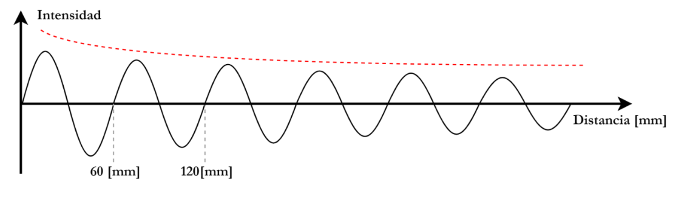

En la imagen se observa una onda senoidal cuya amplitud disminuye con la distancia. Es decir, se observa un efecto de **atenuación**. La frecuencia de la onda se mantiene constante.

La frecuencia $f$ de la onda se puede calcular usando la relación:

$$
\Large f = \frac{v}{\lambda}
$$

donde:
- $v$ es la velocidad de propagación de la onda
- $\lambda$ es la longitud de onda.

De la imagen se extrae que $\lambda = 60\ \text{mm} = 0.06\ \text{m}$.  
Suponiendo que la onda se propaga en el vacío a velocidad $v = 3\times10^8 \ \text{m/s}$, se obtiene:

$$
\Large f = \frac{3\times10^8}{0.06} = 5 \ \text{GHz}
$$

### Bandas del espectro según la ITU y su relación con la onda analizada

| Banda | Abreviatura | Rango de Frecuencia | Rango de Longitud de Onda |
|-------|--------------|---------------------|---------------------------|
| Muy Baja Frecuencia | VLF | 3 a 30 kHz | 10 a 100 km |
| Baja Frecuencia | LF | 30 a 300 kHz | 1 a 10 km |
| Media Frecuencia | MF | 300 a 3000 kHz | 100 a 1000 m |
| Alta Frecuencia | HF | 3 a 30 MHz | 10 a 100 m |
| Muy Alta Frecuencia | VHF | 30 a 300 MHz | 1 a 10 m |
| Ultra Alta Frecuencia | UHF | 300 a 3000 MHz | 10 a 100 cm |
| Super Alta Frecuencia | SHF | 3 a 30 GHz | 1 a 10 cm |
| Extremadamente Alta Frecuencia | EHF | 30 a 300 GHz | 1 a 10 mm |
| Terahercios | THF | 300 a 3000 GHz | 0.1 a 1 mm |

Por lo que la señal se considera SHF (banda 9).

### Ejemplo de dispositivo que opera en esta banda
Un ejemplo de dispositivo que opera en estas bandas son los routers Wi-Fi, que utilizan frecuencias de 2,4 GHz (UHF) y 5 GHz (SHF) para la transmisión de datos inalámbrica.

### Análisis de la atenuación
La línea roja en la imagen representa como la **amplitud de la señal** se **atenúa exponencialmente** con la distancia. Visto solo en dos dimensiones.  

Esta atenuación influye sobre los dispositivos que utilizan **señales electromagnéticas para transmitir datos**. Un caso muy común son los routers Wi-Fi: por ejemplo, la comunicación entre un celular y el router puede disminuir significativamente a medida que ambos se alejan.

La atenuación de la señal afecta a transmisiones por telefonía celular, cable coaxial y fibra óptica, pero de distintas formas.

Se debe tener en cuenta que, cualquiera que sea el medio que atraviesa la señal, esta se verá afectada por su naturaleza. En comunicaciones digitales, esta situación se modela mediante filtros.

Si bien podemos suponer que la energía total de la onda electromagnética se mantiene constante, al expandirse en todas las direcciones, su intensidad en una sola dirección o eje disminuye. Lo que se percibe como atenuación.

**Analizando cada caso:**

1. La telefonía celular se comunica de forma inalámbrica, lo que significa que las ondas electromagnéticas viajan libres en el espacio sin un medio físico que las confine.
Esto permite que la onda se expanda en todas direcciones desde la antena emisora, lo que provoca que la potencia se distribuya sobre un área cada vez mayor conforme aumenta la distancia, siguiendo la ley del cuadrado inverso.
Además, durante su propagación, la onda puede sufrir absorción por la atmósfera, pérdidas por dispersión, reflexión y difracción al encontrarse con obstáculos como edificios, árboles o el terreno.

2. Los cables coaxiales están formados por distintas capas: un conductor central, un dieléctrico que lo separa de un conductor externo (blindaje) y una cubierta protectora.
El blindaje y la geometría coaxial permiten que la onda electromagnética viaje en el interior del cable, minimizando la radiación y aislándola del ruido electromagnético externo.
Lo que medimos en los extremos del cable no es la “onda” directamente, sino la señal eléctrica (tensión y corriente) asociada a esa onda electromagnética.
Tanto el conductor interno como el externo tienen una resistencia finita, por lo que parte de la energía de la onda se pierde como calor debido al efecto Joule.
Aunque el coaxial es muy eficiente en contener la energía, existen pérdidas adicionales por el dieléctrico y pequeñas fugas de radiación, lo que provoca una atenuación mínima pero inevitable de la señal a lo largo del cable.

3. La transmisión por fibra óptica es actualmente una de las más eficientes. Ya que guía pulsos de luz (fotones) a través de un núcleo de vidrio o plástico con mínimas pérdidas. Sin embargo, la atenuación sigue existiendo.
A medida que el haz de luz avanza y se refleja internamente en las paredes del núcleo por reflexión total, una pequeñísima fracción de la energía se pierde en cada rebote debido a absorción en el material y a imperfecciones microscópicas.
Además, el material de la fibra no es perfectamente transparente. Ciertos átomos y enlaces químicos absorben parte de la energía de los fotones y las impurezas o irregularidades dispersan la luz en otras direcciones.
Estos procesos hacen que la potencia óptica disminuya gradualmente con la distancia, aunque a un ritmo mucho menor que en cables eléctricos o en enlaces inalámbricos.

## Actividad 2

### Tipo y modo de transmision:

El sistema representado en la imagen muestra un transmision serie, simplex y sincrono, estas caracteristicas implican lo siguiente:

**Serie (formato)**: Los bits se envían de a uno por el mismo canal en lugar de enviarlos en paralelo.

**Sincrona (temporizacion)**: Existe una línea de reloj compartida que marca exactamente cuándo leer cada bit, evitando la necesidad de bits de inicio/parada.

**Simplex (direccionalidad)**: La comunicación ocurre solo en un sentido (el transmisor envía y el receptor solo recibe).

Este sistema tiene una velocidad de transmision alta, pero no cumple con la bidiriccionalidad requerida, por ende no es el paradigma adecuado.

### Representacion de cuarta letra

La cuarta letra del nombre de grupo es la "g", por ende en binario se representaria como 001100111

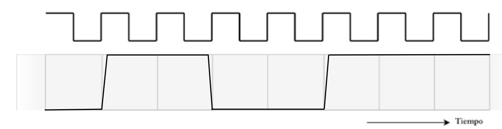

### Medicion de bit 

Debido a que la señal no cambia instantáneamente (pendientes visibles), el muestreo se hace en el centro de cada intervalo de bit para evitar errores por transiciones.

Si la duración de un bit es Tb, el receptor debe muestrear en Tb/2, 3Tb/2, 5Tb/2...

Esto asegura que se lea el valor estable del bit y no la transición.

## Actividad 3

### Gráfico: Modulación de Señal

### Ejemplo 1: PSK

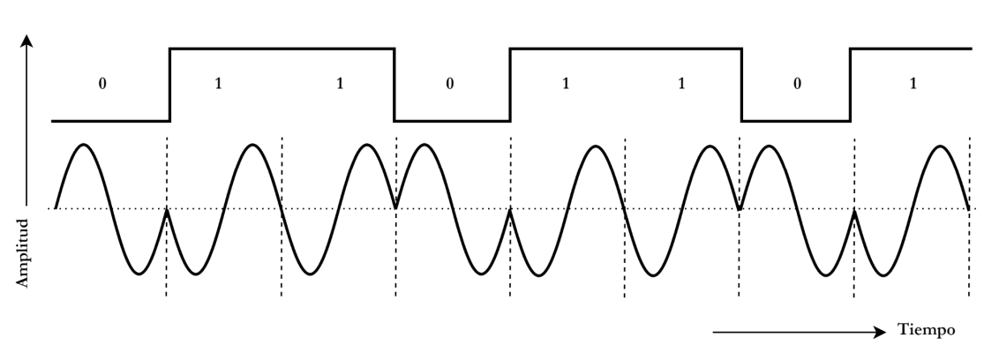

El gráfico representa la señal **0 1 1 0 1 1 0 1** modulada bajo el protocolo **PSK**.

### Ejemplo 2: PSK

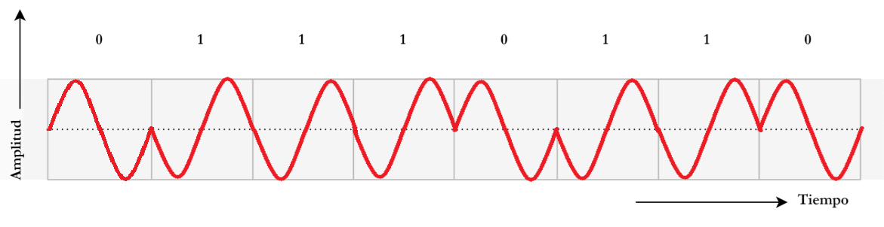

En este caso, se modula la señal **0 1 1 1 0 1 1 0**.

### Principales Técnicas de Modulación Digital

Las tres familias clásicas son:

1. **ASK (Amplitude Shift Keying):**  
   Variación de amplitud (ejemplo: OOK).

2. **FSK (Frequency Shift Keying):**  
   Variación de frecuencia según el bit.

3. **PSK (Phase Shift Keying):**  
   Variación de fase según el bit.

### Variantes de PSK

- **QPSK (Quadrature PSK):**  
  Utiliza 4 fases distintas para codificar 2 bits por símbolo.

- **8-PSK, 16-PSK, etc.:**  
  Aumentan la cantidad de bits por símbolo, pero requieren mayor SNR.

- **DQPSK (Differential QPSK):**  
  La información está en el cambio de fase relativo, no en la fase absoluta.

Además, existen combinaciones avanzadas como **QAM (Quadrature Amplitude Modulation)**, que mezcla amplitud y fase.

### BER (Bit Error Rate)

El **BER (Bit Error Rate)** es la **tasa de error de bits**: la proporción de bits recibidos erróneamente respecto al total de bits transmitidos.

### Comparación de Técnicas según BER

- **ASK/OOK:**  
  Más vulnerable al ruido, ya que el ruido en amplitud puede confundirse fácilmente con un 1.

- **FSK:**  
  Mejor desempeño en ambientes ruidosos porque la frecuencia es más robusta.

- **PSK (especialmente BPSK):**  
  Mejor relación señal/ruido y menor BER que ASK y FSK con la misma potencia de transmisión.

- **QAM:**  
  Eficiente en ancho de banda, pero más sensible al ruido.

## Actividad 4

### Construcción de red simple en software Packet Tracer 

Se comienza colocando solamente un router inalámbrico, WRT300N, y configurando el mismo con las siguientes características:

- IP : 192.168.0.1
- Subnet Mask : 255.255.255.0
- SSID : pingFloyd
- Authentication : WPA2-PSK

Se presenta la configuración en Packet Tracer: 

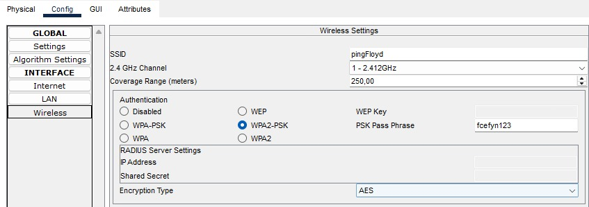

Analizando el router podemos observar que el mismo opera en la frecuencia de 2.4 GHz, según el analisis realizado anteriormente y con las definiciones de la ITU podemos afirmar que el router opera en la banda llamada UHF (Ultra Alta Frecuencia). Dentro del espectro electromagnético podemos encontrar que las ondas que operan con estas frecuencias se encuentran en la región de las ondas de radio, dentro de una banda de frencuencias también conocidas como ISM (Industrial, Scientific and Medical), que es una banda liberada para uso sin licencia en muchos países.

A continuación vamos a agregar diferentes dispositivos a la red, entre ellos una PC de escritorio y una laptop.

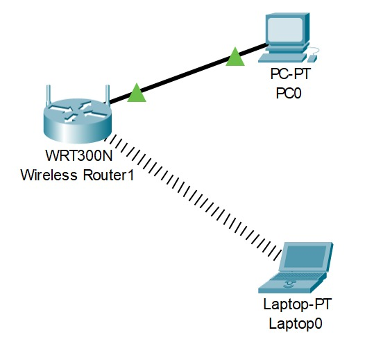

Mediante la función de Command Prompt vamos a corrobar la conectividad entre los dispositivos y su correcto funcionamiento, primero utilizaremos la función "ipconfig" para visualizar la conectividad de cada dispositivo y sus respectivas características.

### Desde la PC de escritorio podemos visualizar: 

C:\> ipconfig

FastEthernet0 Connection:(default port)

   Connection-specific DNS Suffix..: 

   Link-local IPv6 Address.........: FE80::202:4AFF:FE92:2097

   IPv6 Address....................: ::

   IPv4 Address....................: 192.168.0.101

   Subnet Mask.....................: 255.255.255.0

   Default Gateway.................: ::
                                     192.168.0.1

Bluetooth Connection:

   Connection-specific DNS Suffix..: 

   Link-local IPv6 Address.........: ::

   IPv6 Address....................: ::

   IPv4 Address....................: 0.0.0.0

   Subnet Mask.....................: 0.0.0.0

   Default Gateway.................: ::
                                     0.0.0.0

### Desde la laptop podemos visualizar: 

C:\>ipconfig

Bluetooth Connection:(default port)

   Connection-specific DNS Suffix..: 

   Link-local IPv6 Address.........: ::

   IPv6 Address....................: ::

   IPv4 Address....................: 0.0.0.0

   Subnet Mask.....................: 0.0.0.0

   Default Gateway.................: ::
                                     0.0.0.0

Wireless0 Connection:

   Connection-specific DNS Suffix..: 

   Link-local IPv6 Address.........: FE80::2D0:58FF:FEA3:46AA

   IPv6 Address....................: ::

   IPv4 Address....................: 192.168.0.100

   Subnet Mask.....................: 255.255.255.0

   Default Gateway.................: ::
                                     192.168.0.1

Ahora para verificar la conectividad entre ambos vamos a realizar diferentes pings desde un dispositivo a otro, para ello haremos uso de la función "ping" y de la IP del dispositivo al que le realizaremos el ping. La siguiente imagen muestra la salida al ejecutar ese comando:

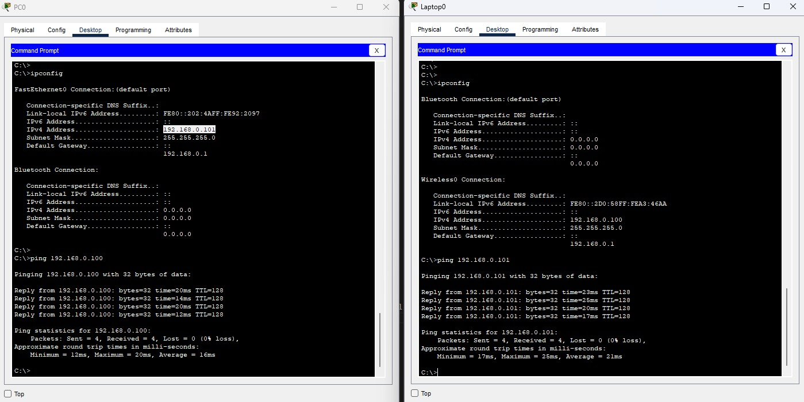

Al observar la representación del modelo físico podemos visualizar el alcance que posee el router inalámbrico y la red Wi-Fi:

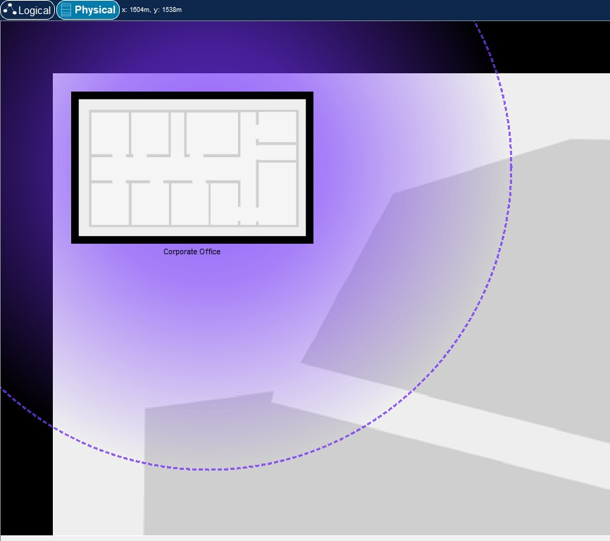

Para concluir la experiencia se agregará una laptop más, primero veremos como funciona dentro del rango alcanzable del Wi-Fi y posteriormente la sacaremos fuera del mismo y observaremos su conectividad y estado.

Antes de conectar la notebook al router Wi-Fi podemos notar como disminuye la potencia de la señal al estar el dispositivo casi al limite del alcance máximo, es decir, al aumentar la distancia entre el router y el dispositivo final:

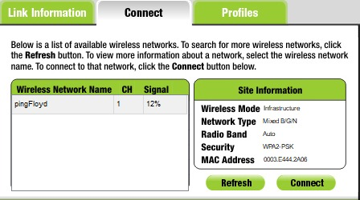

Ahora una vez conectada la laptop al Wi-Fi podemos observar la interfaz de esta nuevamente haciendo uso del comando ipconfig:

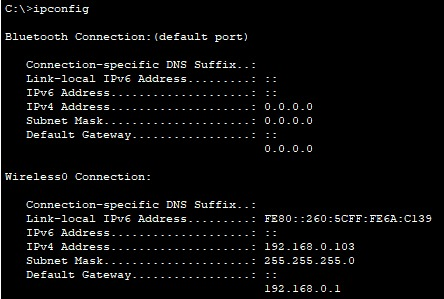

Ademas corroboramos la conexion con las otras computadoras realizando pings entre ellas y chequeando que se lleven a cabo con exito, primero desde la ultima laptop hacia la colocada al principio: 

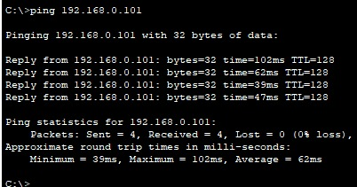

Ahora realizaremos el ping al reves, devolviendoselo a la laptop más reciente: 

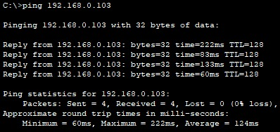

El último paso es colocarla fuera del rango del Wi-Fi y chequear si existe comunicacion entre los dispositivos, de esta manera se comprobará que la conexión y comunicación se está realizando gracias al correcto funcionamiento del router, primero se realiza un ping desde la laptop que está fuera del rango hacia un dispositivo dentro del mismo:

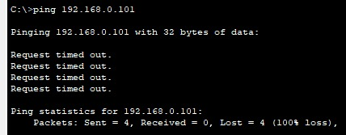

Notaremos que se produce un "time out" , se envian 4 paquetes pero no se recibe ninguno generando una perdida o loss del 100%, esto debido a que no existe conexión alguna entre los dispositivos, correspondiendose con lo esperado. La última verificación será hacer uso del comando tracert que nos muestra la ruta que siguen los diferentes paquetes para llegar a su destino, mostrandonos todos los saltos o intermediarios y el respectivo tiempo que tardan. 

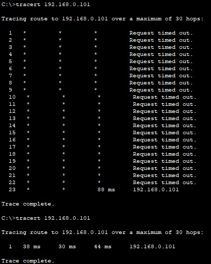

La imagen nos muestra lo esperado, se quiere seguir la ruta que siguen los paquetes pero al no existir conexión entre los dispositivos no existe tal ruta y el tiempo que tomarían tampoco se marca. Notamos que al momento de introducir la laptop dentro del rango del Wi-Fi automáticamente se muestra el tiempo y la traza se completa. Luego se vuelve a ejecutar el mismo comando con la laptop totalmente conectada al Wi-Fi y la traza se muestra de manera exitosa.

## Conclusiones
Se logró repasar conceptos fundamentales que son base para la materia Comunicación de Datos. Siendo estos: ondas electromagnéticas, tipos de transmisión y técnicas de modulación. 
Además, se realizó una primera experiencia con la herramienta Packet Tracer, lo que permitió aplicar los conocimientos teóricos, familiarizarse con el entorno de simulación y observar el comportamiento de una red básica. 
Estas actividades refuerzan la comprensión de los principios de transmisión de datos y sientan las bases para estudios más avanzados en la materia.

