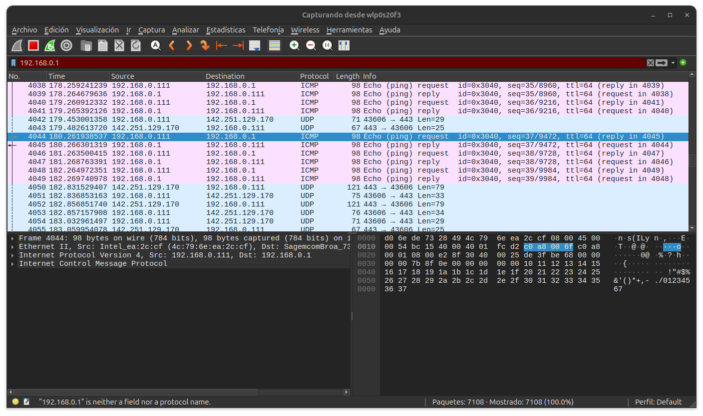

### ¿Qué es el Ethernet? ¿Cuáles son sus características principales? ¿Cómo se conforma una trama de datos en Ethernet? ¿Qué diferencias hay entre Ethernet, Fast Ethernet, y Gigabit Ethernet?

Ethernet es una tecnologia de red de area local (Lan) que define estandares para el cableado y la transmision de datos entre dispositivos. Sus principales caracteristicas son: topologia en bus o estrella, acceso al medio mediante CSMA/CD, velocidades tipicas de 10 Mbps (ethernet), 100 Mbps (fast ethernet) y 1 Gbps (gigabit ethernet), y uso de tramas para la transmision de datos.

Una trama Ethernet se compone de los siguientes campos:
- Preambulo (7 bytes) y SFD (1 byte)
- Dirección MAC de destino (6 bytes)
- Dirección MAC de origen (6 bytes)
- Tipo/Longitud (2 bytes)
- Datos (46-1500 bytes)
- CRC/FCS (4 bytes)

Las diferencias principales entre Ethernet, Fast Ethernet y Gigabit Ethernet son la velocidad de transmisión (10 Mbps, 100 Mbps y 1 Gbps respectivamente) y los requisitos de cableado (Fast y Gigabit requieren cables de mayor calidad).

### ¿Qué es un cable UTP? ¿Qué relación tiene la construcción de este cable con los conceptos vistos en el ítem 2) de este trabajo? ¿Qué diferencias hay entre un cable UTP “derecho” y uno “cruzado”?


Un cable UTP (Unshielded Twisted Pair) es un tipo de cable de par trenzado sin apantallamiento, muy utilizado en redes Ethernet. La clave de su construcción está en el trenzado de los pares de hilos: esto ayuda a que las interferencias externas, como el ruido electromagnético generado por motores o herramientas eléctricas (como se muestra en la figura del ítem 2), afecten de manera similar a ambos hilos de cada par. Así, el efecto del ruido se cancela y la señal transmitida se mantiene más limpia y confiable. Por eso, el cable UTP es especialmente útil para reducir el impacto de la interferencia y el ruido en la transmisión de datos, tal como se analiza en el fenómeno físico del ítem 2.

Un cable UTP “derecho” conecta los pines de igual número en ambos extremos, y se usa para conectar dispositivos diferentes (PC a switch). Un cable “cruzado” intercambia los pares de transmisión y recepción, y se usa para conectar dispositivos iguales (PC a PC).

### Puerta de enlace predeterminada y captura de paquete en Wireshark

Para averiguar la puerta de enlace predeterminada en Linux, ejecuté el siguiente comando:

```bash
ip route
```
- 

El resultado muestra que la puerta de enlace es `192.168.0.1`.

Luego, realice un ping a la puerta de enlace con:

```bash
ping 192.168.0.1
```

- 

Esto se puede ver en la imagen `ping:floyd.png`.

En Wireshark, filtré los paquetes usando el filtro:

```
ip.addr == 192.168.0.1
```

Capture un paquete ICMP de respuesta y exporte sus datos en formato hexadecimal. Un extracto del paquete es:

d06ede7328494c796eea2ccf080045000054bc1540004001fcd2c0a8006fc0a800010800e28f30400025de3fbe68000000007b8f0e0000000000101112131415161718191a1b1c1d1e1f202122232425262728292a2b2c2d2e2f3031323334353637

- 


### Dirección MAC y fabricante

De la captura anterior, la dirección MAC de origen es: `d0:6e:de:73:28:49`. Buscando el prefijo `d0:6e:de` en un servicio online de búsqueda de MAC, se obtiene:

- Fabricante: AzureWave Technology Inc.
- Dirección: 8F, No. 94, Baozhong Rd., Xindian Dist., New Taipei City 231, Taiwan
