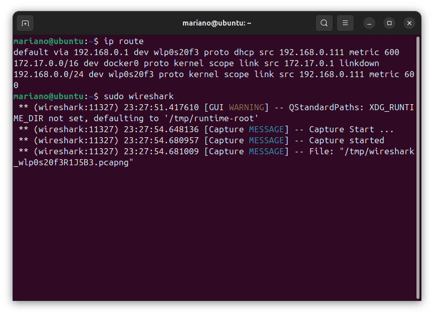
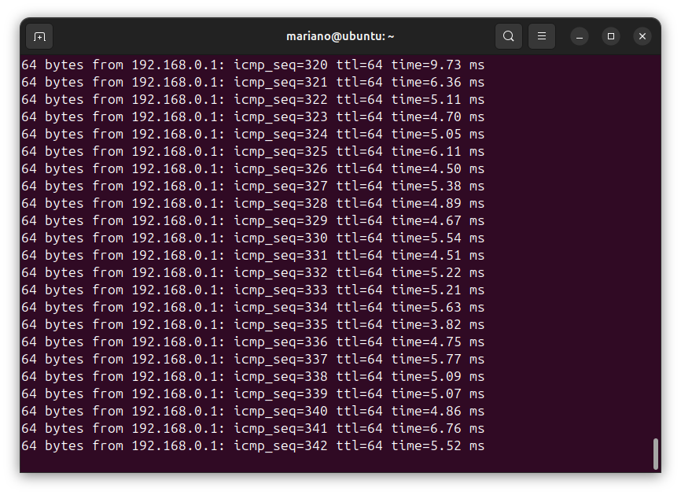
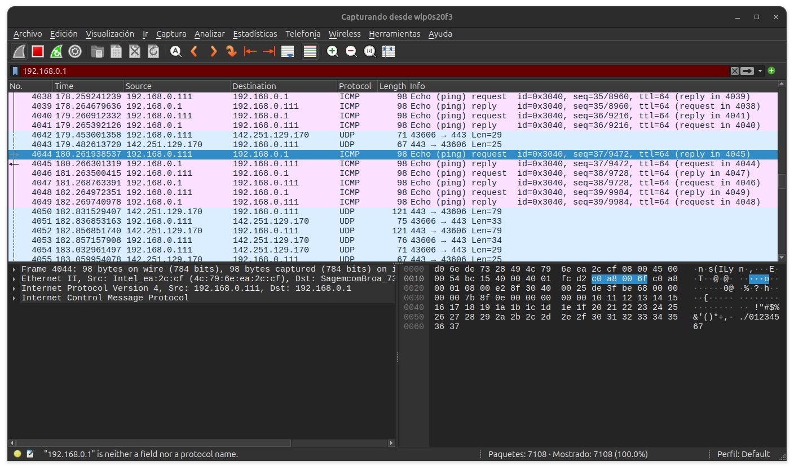

# Trabajo Práctico N°2

**Nombres**  
- Callovi, Lautaro
- Galoppo, José María
- Moreyra, Julián
- Rivera, Luis Mariano

**Nombre del grupo**: pingFloyd

**Nombre del centro educativo**: FCEFYN - UNC

**Nombre de la materia**: Comunicaciones de Datos

**Profesores**
- Solinas, Miguel A.
- Henn, Santiago M.
- Oliva Cuneo, Facundo N.

**Fecha**: 8 de septiembre de 2025

---
### Información de los autores
 
**Información de contacto**:
- jose.maria.galoppo@mi.unc.edu.ar (Galoppo, José María)
- luismarianorivera.25@mi.unc.edu.ar (Rivera, Luis Mariano)
- julian.moreyra@mi.unc.edu.ar (Moreyra, Julián)
- lautaro.callovi@mi.unc.edu.ar (Callovi, Lautaro Nicolás)
---


## Resumen

Este informe presenta una visión integral sobre los principales desafíos y tecnologías en el ámbito de las comunicaciones de datos, abordando los siguientes temas:

**Efecto Doppler:**
- Fundamentos físicos y manifestación en sistemas celulares, satelitales y transmisiones por cable.
- Impacto en la transmisión de señales y en la calidad de las comunicaciones.

**Ruido y calidad de señal:**
- Efectos del ruido, relación señal-ruido (SNR) y tasa de error de bits (BER).
- Influencia en la confiabilidad y desempeño de los sistemas de comunicación.

**Tecnologías de red:**
- Análisis de Ethernet y cables UTP.
- Funcionamiento, estructura y relevancia en la transmisión de datos.

**Privacidad y seguridad:**
- Trazabilidad de dispositivos mediante identificadores como la dirección MAC y el IMEI.
- Alcance y limitaciones de herramientas como las VPN.

## Introducción

En la actualidad, las telecomunicaciones son el pilar fundamental de la conectividad global, permitiendo la transmisión de información a gran velocidad y distancia. Sin embargo, detrás de cada comunicación exitosa existen múltiples desafíos físicos y tecnológicos que deben ser comprendidos y gestionados.

Este desarrollo surge de la necesidad de analizar cómo fenómenos como el efecto Doppler, el ruido y la interferencia pueden afectar la calidad de las señales, y de qué manera las tecnologías de red y las estrategias de seguridad buscan mitigar estos problemas. A través de ejemplos prácticos y el estudio de casos reales, se busca no solo describir los conceptos técnicos, sino también reflexionar sobre su impacto en la vida cotidiana y en la evolución de las redes modernas.

La motivación principal es brindar una comprensión integral de los factores que influyen en la transmisión de datos, destacando la importancia de la innovación tecnológica y la conciencia sobre la privacidad y la seguridad en un mundo cada vez más interconectado.

# Desarrollo

### Actividad 1

### Efecto Doppler en las telecomunicaciones

En la imagen se puede observar cómo una señal, mientras viaja por un medio, va variando su frecuencia.  
Una de las posibles causas de esta variación es el **efecto Doppler**, que afecta directamente a las telecomunicaciones, especialmente a las comunicaciones inalámbricas entre fuentes emisoras y receptoras en movimiento.  

El efecto es poco perceptible en la comunicación entre una antena y teléfonos celulares en superficie, pero resulta muy importante tenerlo en cuenta cuando se establece comunicación con satélites.  

El efecto Doppler se caracteriza por lo siguiente:  

- Cuando las fuentes (emisora y receptora) se **acercan**, el frente de onda aumenta su frecuencia percibida.  
- Cuando las fuentes se **alejan**, el frente de onda disminuye su frecuencia percibida.  

Es importante aclarar que, si las fuentes se mueven con **velocidad constante**, el efecto Doppler existe, pero la frecuencia percibida se mantiene constante durante el desplazamiento. En cambio, si las fuentes presentan **aceleración**, la frecuencia sí varía a lo largo del tiempo.

---

### Las comunicaciones con altas frecuencias vs el efecto doppler

La frecuencia percibida $f'$ se calcula mediante la fórmula general del efecto Doppler:

$$
f' = f \cdot \frac{c \pm v_r}{c \pm v_s}
$$

donde:

- $f$ = frecuencia emitida  
- $f'$ = frecuencia percibida  
- $c$ = velocidad de propagación de la onda (≈ velocidad de la luz en telecomunicaciones)  
- $v_r$ = velocidad del receptor (signo positivo si se acerca, negativo si se aleja)  
- $v_s$ = velocidad de la fuente (signo positivo si se aleja, negativo si se acerca)  

Se puede observar que la frecuencia de la señal emitida es directamente proporcional a la frecuencia percibida. Por lo tanto, las **comunicaciones con señales de alta frecuencia son más susceptibles al efecto Doppler**, ya que incluso velocidades moderadas pueden generar corrimientos significativos de frecuencia.

### Ejemplos de transmisiones según su susceptibilidad al Doppler

- **Alta frecuencia (UHF y SHF, 300 MHz – 30 GHz):**  
  - Bandas utilizadas en 4G/LTE, 5G sub-6 GHz y mmWave.  
  - Doppler moderado a alto, requiere corrección en la modulación y sincronización.  

- **Frecuencia extremadamente alta (EHF, 30–300 GHz):**  
  - Enlaces satelitales (banda Ka), WiFi mmWave, enlaces punto a punto de alta capacidad.  
  - Doppler muy significativo incluso a velocidades moderadas; se necesita compensación activa.  

- **Frecuencias bajas (MF, VHF, HF, 0.5–300 MHz):**  
  - Radio AM/FM, TV terrestre, radioaficionados.  
  - Doppler despreciable; la variación en Hz es mínima en comparación con la frecuencia de la señal.  

### Comunicaciones menos afectadas

- **Comunicaciones por cable:** fibra óptica, cable coaxial, DSL.  
  - No se ven afectadas por movimiento relativo entre transmisor y receptor.  

- **Enlaces terrestres de baja frecuencia:** radio AM/FM, VHF, HF.  

- **Redes inalámbricas estacionarias o de corta distancia:** WiFi convencional en interiores, dispositivos IoT fijos.  

---

### Teléfonos celulares en aviones

Actualmente, gracias a los avances tecnológicos, **encender los celulares dentro de un avión no representa riesgos significativos**.  

Sin embargo, esto no siempre fue así. Hace algunos años, los teléfonos celulares podían operar en **las mismas bandas de frecuencia que algunos instrumentos del avión**, lo que **podía generar interferencias**.  

Es importante aclarar que esto **no tiene relación con el efecto Doppler**. La interferencia es un fenómeno distinto, que ocurre cuando señales electromagnéticas de frecuencias similares se superponen y afectan el funcionamiento de los equipos.

.
.
.

.
.
.


## Conclusiones

El efecto Doppler es un fenómeno fundamental en las telecomunicaciones, cuya importancia aumenta con la frecuencia de la señal y la velocidad relativa entre emisor y receptor. 
En comunicaciones inalámbricas de alta frecuencia, como 5G mmWave o enlaces satelitales, el corrimiento Doppler puede ser significativo y requiere compensación activa para mantener la integridad de la señal.


### Actividad 2

### Efecto del ruido en las comunicaciones

La imagen mostrada describe una onda electromagnetica para la transmision de datos a un dispositivo movil, en su trayectoria esta se ve afectada por ruido. Sus caracteristicas principales son:

- **Es una onda electromagnetica** que transporta informacion.
- **Esta expuesta al ruido** (aleatorio, no deseado) que degrada la calidad de la senial.
- **Atenuacion con la distancia**, es decir, la senial pierde potencia conforme viaja.
- Puede sufrir **interferencias** de otras seniales en la misma banda.
- **El receptor debe demodular y filtrar** para recuperar la senial original.


### Efecto en bandas de transmision

El ruido y la interferencia afectan en distinta medida según la banda de frecuencia:

- **Frecuencias bajas**: son más resilientes, ya que tienen mayor alcance y mejor propagación, aunque su ancho de banda disponible es limitado.

- **Frecuencias altas**: se ven más afectadas por el ruido, la atenuación y las interferencias, además de obstáculos físicos. Sin embargo, permiten mayor velocidad de transmisión de datos.

#### La resiliencia de estas depende de:

- **El tipo de modulación**: modulaciones robustas como BPSK o QPSK son más resistentes, mientras que modulaciones de mayor orden (16-QAM, 64-QAM) son más vulnerables al ruido.

- **La redundancia y codificación de canal**: técnicas de corrección de errores ayudan a mitigar la degradación.

### SNR y BER

La **SNR** *(Signal to Noise Ratio)* es la relacion entre la potencial de la senial y la potencia del ruido, expresada en decibelios (dB). A mayor SNR, mejor la calidad de recepcion.

$$
\text{SNR}_{dB} = 10 \log_{10} \left( \frac{P_{\text{signal}}}{P_{\text{noise}}} \right)
$$

El **BER** *(Bit Error Rate)* por otro lado, es la tasa de error de bits, es decir, la proporcion de bits recibidios erroneamente respecto al total transmitido

$$
\text{BER} \approx \frac{c}{\log_2 M} \, Q\!\left(\sqrt{\frac{2 \cdot \log_2 M}{M-1} \cdot \frac{E_b}{N_0}}\right)
$$

#### ¿Como se relacionan?

- **Una SNR alta** → menor probabilidad de errores → BER bajo.
- **Una SNR baja** → la señal queda sumergida en el ruido → BER alto.

Por eso, la SNR es un parámetro crítico para estimar el desempeño de un canal de comunicación digital.


## Actividad 3

### ¿Qué es el Ethernet? ¿Cuáles son sus características principales? ¿Cómo se conforma una trama de datos en Ethernet? ¿Qué diferencias hay entre Ethernet, Fast Ethernet, y Gigabit Ethernet?

Ethernet es una tecnologia de red de area local (Lan) que define estandares para el cableado y la transmision de datos entre dispositivos. Sus principales caracteristicas son: topologia en bus o estrella, acceso al medio mediante CSMA/CD, velocidades tipicas de 10 Mbps (ethernet), 100 Mbps (fast ethernet) y 1 Gbps (gigabit ethernet), y uso de tramas para la transmision de datos.

Una trama Ethernet se compone de los siguientes campos:
- Preambulo (7 bytes) y SFD (1 byte)
- Dirección MAC de destino (6 bytes)
- Dirección MAC de origen (6 bytes)
- Tipo/Longitud (2 bytes)
- Datos (46-1500 bytes)
- CRC/FCS (4 bytes)

Las diferencias principales entre Ethernet, Fast Ethernet y Gigabit Ethernet son la velocidad de transmisión (10 Mbps, 100 Mbps y 1 Gbps respectivamente) y los requisitos de cableado (Fast y Gigabit requieren cables de mayor calidad).

### ¿Qué es un cable UTP? ¿Qué relación tiene la construcción de este cable con los conceptos vistos en el ítem 2) de este trabajo? ¿Qué diferencias hay entre un cable UTP “derecho” y uno “cruzado”?


Un cable UTP (Unshielded Twisted Pair) es un tipo de cable de par trenzado sin apantallamiento, muy utilizado en redes Ethernet. La clave de su construcción está en el trenzado de los pares de hilos: esto ayuda a que las interferencias externas, como el ruido electromagnético generado por motores o herramientas eléctricas (como se muestra en la figura del ítem 2), afecten de manera similar a ambos hilos de cada par. Así, el efecto del ruido se cancela y la señal transmitida se mantiene más limpia y confiable. Por eso, el cable UTP es especialmente útil para reducir el impacto de la interferencia y el ruido en la transmisión de datos, tal como se analiza en el fenómeno físico del ítem 2.

Un cable UTP “derecho” conecta los pines de igual número en ambos extremos, y se usa para conectar dispositivos diferentes (PC a switch). Un cable “cruzado” intercambia los pares de transmisión y recepción, y se usa para conectar dispositivos iguales (PC a PC).

### Puerta de enlace predeterminada y captura de paquete en Wireshark

Para averiguar la puerta de enlace predeterminada en Linux, ejecuté el siguiente comando:

```bash
ip route
```


El resultado muestra que la puerta de enlace es `192.168.0.1`.

Luego, realice un ping a la puerta de enlace con:

```bash
ping 192.168.0.1
```



Esto se puede ver en la imagen `ping:floyd.png`.

En Wireshark, filtré los paquetes usando el filtro:

```
ip.addr == 192.168.0.1
```

Capture un paquete ICMP de respuesta y exporte sus datos en formato hexadecimal. Un extracto del paquete es:

d06ede7328494c796eea2ccf080045000054bc1540004001fcd2c0a8006fc0a800010800e28f30400025de3fbe68000000007b8f0e0000000000101112131415161718191a1b1c1d1e1f202122232425262728292a2b2c2d2e2f3031323334353637




### Dirección MAC y fabricante

De la captura anterior, la dirección MAC de origen es: `d0:6e:de:73:28:49`. Buscando el prefijo `d0:6e:de` en un servicio online de búsqueda de MAC, se obtiene:

- Fabricante: AzureWave Technology Inc.
- Dirección: 8F, No. 94, Baozhong Rd., Xindian Dist., New Taipei City 231, Taiwan


## Actividad 4
A partir de los resultados obtenidos, del trabajo aquí realizado e información obtenida de diferentes medios de Internet, podemos llegar a elaborar algunas conclusiones:

- *Privacidad de un dispositivo en la red*

    Podríamos decir que la privacidad dentro de una red no es una característica que viene por defecto, la privacidad hace referencia a que tan protegida esta la información que nosotros como usuarios manejamos y enviamos al estar conectados a una red ya que esta puede ser vulnerable a ataques. Por ejemplo: en una red LAN (de Wi-Fi sin contraseña), uno como usuario puede simplemente confiar que no hay nadie espiando el tráfico de datos pero al ser abierta cualquiera puede usar algún tipo de sniffer para capturar el tráfico que no está cifrado. 
    Al conectarnos a una red podemos exponer información como direcciones IP, MAC del dispositivo, Metadatos, etc. Aunque nosotros tomemos buenas medidas de seguridad siempre podemos estar expuestos a ataques, lo mejor sería combinar tanto la tecnología como cifrado y protocolos junto a la consciencia del usuario a la hora de conectarse a la red.

- *Trazabilidad de la dirección MAC*

   Como nombramos anteriormente la dirección MAC del dispositivo puede estar expuesta a la hora de conectarnos a una red. La dirección MAC es un identificador único integrado en el dispositivo, es una cadena única de números y letras que identifican y pertenecen al hardware del dispositivo utilizado, se codifica en la tarjeta de interfaz de red, NIC. Esta sirve para que los dispositivos se reconozcan en una red. Aunque en redes más grandes esta no viaja más allá del router, dentro de una empresa o campus (LAN) puede ocurrir que esta, al ser única de un dispositivo, pueda ser falsificada por atacantes (spoofing). Para evitar esto algunos sistemas operativos modernos llevan a cabo la aleatorización de la misma, es decir, generar direcciones MAC aleatorias para cada red que se conecte el dispositivo.

- *Similitud de IMEI con MAC*

   El IMEI, International Mobile Equipment Identity (Identidad Internacional de Equipo Móvil), es un número único de 15 dígitos que identifica a cada telefono móvil o dispositivo con módem celular, está grabado en el hardware del equipo y no se repite, es único. Sirve para poder identificar un dispositivo en la red celular y diferenciarlo de la línea o chip SIM. 
   Podríamos decir que tanto el IMEI como la dirección MAC funcionan como "huellas digitales" de hardware que lo provee el fabricante de cada dispositivo. El IMEI opera en redes celulares e identifica al equipo físico, mientras que la MAC opera en redes locales e identifica a la interfaz de red. 
   Una diferencia es que el IMEI es mucho mas difícil de cambiar o alterar que la MAC de un dispositivo.

- *¿Una VPN oculta la dirección MAC del dispositivo?*

   Una VPN cifra todo el tráfico entre un dispositivo y el servidor VPN, oculta la dirección IP pública y evita que el proveedor de Internet vea el contenido del tráfico. Ahora, esto no oculta ni modifica la dirección MAC del dispositivo dentro de la red local, por lo que otros dispositivos que esten conectados a la misma red local o LAN son capaces y podrían ver mi dirección MAC, incluso utilizando una VPN.

Tanto la dirección MAC del dispositivo y el IMEI funcionan como identificadores únicos del hardware, uno en redes locales y el otro en redes celulares respectivamente, aunque estas facilitan la trazabilidad y la gestión, de la misma manera pueden suponer un riesgo si no tomamos las medidas necesarias.
De esta manera forma podemos afirmar que siempre debemos actuar con cautela a la hora de conectarnos a una red, la seguridad de la misma nunca está asegurada.