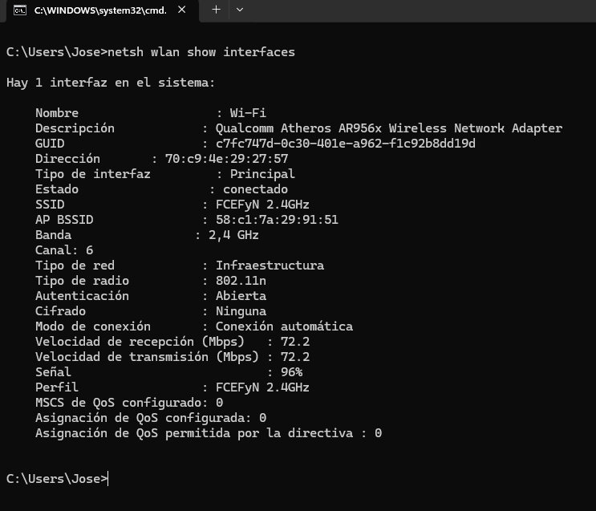

## Introduccion - Parte de José
Los estándares IEEE 802.3 e IEEE 802.11 son fundamentales para el buen funcionamiento de las redes hoy en día, ya sean cableadas (802.3) o inalámbricas (802.11).
A medida que la tecnología fue avanzando, estos estándares se fueron modificando para ofrecer mejores prestaciones. Temas como velocidad, modulaciones e incluso aspectos normativos y de seguridad fueron cambiando con el paso de los años.

## Resumen - Parte de José
Se presenta parte de la evolución de los estándares IEEE 802.3 e IEEE 802.11.
Se comenta la relación entre los protocolos y los niveles de seguridad.
Se realiza una prueba práctica para determinar los estándares de red utilizados en la facultad.

## Desarrollo - Parte de José

### Estándares 802.3 y 802.11

**IEEE 802.3**

El estándar IEEE 802.3 se remonta a 1983 y fue el primer intento de estandarizar redes Ethernet, que previamente utilizaban otros formatos como Ethernet II. Este estándar buscaba normalizar las velocidades de transmisión y los medios físicos, que en ese momento eran principalmente cables coaxiales.

Al inicio, existía una pequeña diferencia entre las cabeceras definidas por Ethernet y las de 802.3, particularmente en el campo ubicado después de las direcciones de destino y origen dentro del header.

Desde entonces, el estándar ha tenido varias ampliaciones, abarcando aspectos como velocidades, redes virtuales (VLANs), hubs, switches y distintos tipos de medios. Una de las últimas modificaciones importantes fue IEEE 802.3df‑2024, publicada el 15 de marzo de 2024, en la que se establecieron nuevos parámetros MAC y PHY, así como nuevas cláusulas técnicas y anexos relacionados con el funcionamiento de Ethernet a altas velocidades.

**IEEE 802.11**

El estándar IEEE 802.11 se remonta a 1997 y tiene como objetivo estandarizar las redes inalámbricas. La primera versión incluía redes que utilizaban infrarrojo, tecnología que hoy en día ya no se usa, aunque aún forma parte del estándar.

La versión IEEE 802.11b fue la primera en ser ampliamente aceptada, ya que ofrecía velocidades competitivas frente a Ethernet y los dispositivos que implementaban este estándar eran más económicos. Además, IEEE 802.11 implementa el protocolo CSMA/CA (Carrier Sense Multiple Access / Collision Avoidance) para gestionar el acceso al medio inalámbrico y evitar colisiones.

Uno de los últimos cambios importantes al estándar fue IEEE 802.11be‑2024 (“Wi‑Fi 7”), publicado el 22 de julio de 2025. Esta versión introduce mejoras de rendimiento extremo (Extremely High Throughput, EHT), alcanzando velocidades de hasta 30 Gbps a nivel MAC, en bandas de frecuencia entre 1 GHz y 7.25 GHz. Además, incluye mejoras en latencia (worst case latency) y jitter, aumentando la confiabilidad de la conexión incluso en condiciones adversas.

### Experimento: Determinar versión del protocolo 802.11 de una red de la facultad

Ejecutando el comando **netsh** en una notebook conectada a la red wifi, se pudo observar la versión del protocolo 802.11 de la red FCEFyN.

### Redes y dispositivos incompatibles
Si un dispositivo tiene una NIC que no soporta el estándar de la red (por ejemplo, Wi‑Fi), no podrá establecer conexión. La red puede no aparecer en la lista de redes disponibles, o bien, en algunos casos, la conexión se logra pero funciona muy lentamente y puede sufrir interrupciones frecuentes constantemente.

### Protocolos y seguridad

A medida que los estándares Wi‑Fi fueron evolucionando, también mejoraron los mecanismos de seguridad, incluyendo métodos de cifrado y algoritmos de autenticación, con el objetivo de proteger las conexiones frente a accesos no autorizados.

Una de las primeras formas de seguridad fue WEP (Wired Equivalent Privacy), que aunque permitía cifrar la información, resultó ser muy vulnerable a ataques y podía ser fácilmente vulnerada por terceros. Posteriormente, se introdujo WPA (Wi‑Fi Protected Access), seguido de WPA2, que incorporó cifrado AES y mejoras en la gestión de claves, proporcionando una protección mucho más robusta.

Actualmente, el estándar WPA3 es uno de los más recientes y seguros, ofreciendo autenticación avanzada, cifrado individualizado y protección frente a ataques modernos, como el “key reinstallation attack” (KRACK).

Cada nueva versión del estándar Wi‑Fi corrige vulnerabilidades de versiones anteriores, asegurando conexiones más confiables y seguras para los usuarios.

| -                       | WIFI 5                         | WIFI 6                         | WIFI 7                         |
|-------------------------|--------------------------------|--------------------------------|--------------------------------|
| Versión IEEE            | IEEE 802.11ac                  | IEEE 802.11ax                  | IEEE 802.11be                  |
| Tasa de datos máxima    | Hasta 3.5 Gbps                 | Hasta 9.6 Gbps                 | Hasta 46 Gbps                  |
| Banda(s)                | 5 GHz (también 2.4 GHz)        | 5 GHz (también 2.4 GHz)        |6 GHz (también 2.4 GHz y 5 GHz) |
| Ancho de Banda          | Entre 80 y 160 MHz por canal   | Entre 80 y 160 MHz por canal   | Entre 80 y 320 MHz por canal   |
| Modulación              | 256-QAM                        | 1024-QAM                       |4096-QAM                        |
| Sistema de Seguridad    | Hasta WPA2                     | Hasta WPA3                     |Hasta WPA3                      |

