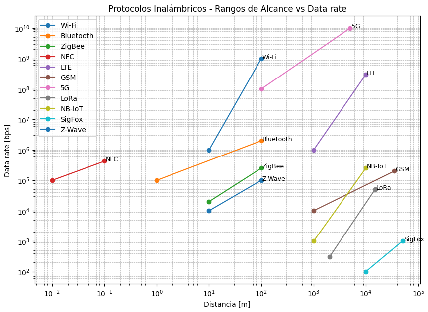

# Trabajo Práctico N°3

**Integrantes**  
- Callovi, Lautaro
- Galoppo, José María
- Moreyra, Julián
- Rivera, Luis Mariano

**Grupo**: pingFloyd

**Centro educativo**: FCEFYN - UNC

**Asignatura**: Comunicaciones de Datos

**Profesores**
- Solinas, Miguel A.
- Henn, Santiago M.
- Oliva Cuneo, Facundo N.

**Fecha**: 22 de septiembre de 2025

---
### Información de los autores
- jose.maria.galoppo@mi.unc.edu.ar (Galoppo, José María)
- luismarianorivera.25@mi.unc.edu.ar (Rivera, Luis Mariano)
- julian.moreyra@mi.unc.edu.ar (Moreyra, Julián)
- lautaro.callovi@mi.unc.edu.ar (Callovi, Lautaro Nicolás)
---

## Resumen

## Introducción

## Desarrollo

## Actividad 1

## Actividad 2

a) La imagen nos ilustra dos tipos de transmision con fibra optica. En la izquierda se representa la **fibra monomodo**, en la cual un haz de luz viaja por un unico trayecto dentro del nucleo. Este tipo nos ofrece caracteristicas tales como:
+ Mayor ancho de banda
+ Baja atenuacion
+ Minima dispersion

Esto resulta ideal para la transmision en largas distancias en altas velocidades. Sin embargo, tiene un costo elevado de implementacion debido a la presicion que requiere tanto la fibra como los emisores (laseres). 

En la parte de la derecha de la imagen se representa la **fibra multimodo**, donde la luz se propagada a traves de varios caminos o modos. Este tipo de fibra es mas economica y sencilla de instalar, ya que suele utilizar LEDs como fuente de luz, pero representa dispersion modal, lo que la limita en distancia y velocidad de transmision.

b) La **Ley de Snell** establece la relación entre los ángulos de incidencia y refracción de un rayo de luz al pasar de un medio a otro con diferente índice de refracción:
$$
n_1 \cdot \sin(\theta_1) = n_2 \cdot \sin(\theta_2)
$$
En la fibra óptica esta ley explica el fenómeno de reflexión interna total, que es el principio de funcionamiento básico de estas transmisiones. Si el ángulo de incidencia supera un valor crítico, la luz no atraviesa el revestimiento sino que se refleja completamente dentro del núcleo, permitiendo así su propagación a lo largo de la fibra. En el caso de la fibra monomodo, la luz viaja en una unica trayectoria, mientras que en la fibra multimodo son posibles múltiples de estas, todas regidas por la misma ley física.

c) La relación entre las conexiones inalámbricas y la fibra óptica radica en que ambas transmiten información mediante ondas electromagnéticas, aunque en diferentes rangos del espectro. Las conexiones inalámbricas utilizan ondas de radio o microondas que viajan por el aire, mientras que la fibra óptica emplea luz en frecuencias mucho más altas, confinada dentro de la fibra.

## Actividad 3

# Protocolos de Comunicación Inalámbrica e IoT

a) Protocolos y Estándares

| Protocolo | ¿Está estandarizado? | Estándar / Última versión |
|-----------|----------------------|---------------------------|
| Wi-Fi     | Sí                   | IEEE 802.11 (última: 802.11be - Wi-Fi 7) |
| Bluetooth | Sí                   | IEEE 802.15.1 / Bluetooth 5.4 |
| ZigBee    | Sí                   | IEEE 802.15.4 |
| NFC       | Sí                   | ISO/IEC 18092, ECMA-340 |
| LTE       | Sí                   | 3GPP Release 8 (evoluciones hasta Release 14 LTE-Advanced Pro) |
| GSM       | Sí                   | 3GPP TS 45.x / ETSI (GSM Release 1990+) |
| 5G (3GPP) | Sí                   | 3GPP Release 15–18 (NR - New Radio) |
| LoRa      | Parcial (LoRa propietario, LoRaWAN estandarizado) | LoRaWAN por LoRa Alliance (v1.0.4, 2021) |
| NB-IoT    | Sí                   | 3GPP Release 13 en adelante |
| SigFox    | No completamente (propietario) | Especificación propietaria de SigFox |
| Z-Wave    | Sí (desde 2012 en ITU-T) | ITU-T G.9959 |

---

b) Gráfico de Alcance vs Tasa de Datos

Ubicación aproximada de los protocolos en el gráfico (Data rate vs Distance):

- **Wi-Fi** → ~100 m, hasta varios Gbps.  
- **Bluetooth** → ~10 m, hasta 2–3 Mbps (Bluetooth 5.4 puede llegar a 100 m en modos especiales).  
- **ZigBee** → ~10–100 m, hasta 250 kbps.  
- **NFC** → <10 cm, hasta 424 kbps.  
- **LTE** → ~10 km, hasta 300 Mbps.  
- **GSM** → ~35 km (máx. celda), hasta 200 kbps (EDGE).  
- **5G** → ~1–10 km, hasta 10 Gbps.  
- **LoRa** → ~2–15 km, hasta 50 kbps.  
- **NB-IoT** → ~10 km, hasta 250 kbps.  
- **SigFox** → ~10–50 km, hasta 100 bps.  
- **Z-Wave** → ~100 m, hasta 100 kbps.  

---

c) Comparación de Medios de Transmisión

| Característica | UTP | Fibra Óptica | Wi-Fi 802.11be (Wi-Fi 7) | Bluetooth 5.4 | 5G |
|----------------|-----|--------------|---------------------------|---------------|----|
| **Ancho de banda** | Hasta 10 Gbps (Cat6a/7), 40 Gbps en Cat8 | >1 Tbps (en laboratorio), típicamente 100 Gbps comercial | Hasta 46 Gbps | ~2 Mbps (modo clásico), hasta 2 Mbps LE; alcance extendido <1 Mbps | >10 Gbps (teórico, con anchos de banda de 400 MHz) |
| **Distancias** | 100 m máx. | Varios km (decenas con repetidores) | ~100 m | 10–100 m | 1–10 km |
| **Inmunidad a EMI/RFI** | Baja | Muy alta | Media (puede afectarse) | Media | Media-alta |
| **Costos de medios/conectores/dispositivos** | Bajo | Alto | Medio | Bajo | Alto |
| **¿Disponible en Packet Tracer?** | Sí | Sí | Sí (802.11ac/ax según versión) | No | No |

---

## Actividad 4

a) Al hablar de conectividad a Internet en un avión en vuelo surgen algunas tecnologías que pueden hacerlo posible. Aquí se encontrarán detalladas con sus características y limitaciones:

### Tecnología Satelital o Satellite Communications (SATCOM)
Esta tecnología permite a los aviones conectarse con satélites en órbita, entre ellos tenemos a:
+ Satélites Geoestacionarios (GEO) que se encuentran a unos 36000 km de altitud, incluyendo una amplia cobertura hasta para rutas transoceánicas pero puede incluir cierta latencia por la gran distancia.
+ Satélites de Órbita Media (MEO) a una altitud de 2000 a 20000 km, suelen ofrecer una menor latencia que los GEO pero se necesita de una red de múltiples satélites y antenas para el avión que permitan cambiar de conexión entre satélites.
+ Satélites de Órbita baja (LEO) a una altitud de 500 a 2000 km, un ejemplo es Starlink, estos ofrecen una muy baja latencia y velocidades mas altas que las demás, ideal para videollamadas, streaming y juegos. Su limitación es que se requiere de una gran constelación de miles de satélites para poder ofrecer una cobertura continua y decente.

Estas tecnologías se usan mucho para vuelos transoceánicos o donde no existe una cobertura terrestre.

### Tecnologías Aire-Tierra (ATG Air-to-Ground)
Esta tecnología permite a los aviones conectarse a una red de torres de telefonía móvil que se encuentran instaladas en tierra (como las 4G/5G) mediante una antena ubicada en la parte inferior del avión. 
Estas generalmente son más lentas que las conexiones satelitales ya que depende de que existan las antenas en tierra, además en áreas rurales o zonas donde no se encuentren instaladas muchas torres la conexión puede ser intermitente.

Se suele usar para vuelos sobre tierra firme.

b) 

[1] G. Fontanesi et al., "Artificial Intelligence for Satellite Communication: A Survey," in IEEE Communications Surveys & Tutorials, doi: 10.1109/COMST.2025.3534617.
URL: https://ieeexplore.ieee.org/stamp/stamp.jsp?tp=&arnumber=10886927&isnumber=5451756

[2] S. L. Barbera et al., "SATCOM for Air Traffic Management: Benefits and Technological Roadmap of the FOC Space Segment Solution," 2025 Integrated Communications, Navigation and Surveillance Conference (ICNS), Brussels, Belgium, 2025, pp. 1-10, doi: 10.1109/ICNS65417.2025.10976806. URL: https://ieeexplore.ieee.org/stamp/stamp.jsp?tp=&arnumber=10976806&isnumber=10976746

c) Podríamos pensarlo como dos redes separadas, una interna, donde todo queda dentro de la red del avión sin afectar a la conexión de Internet, con un servidor local gratis e ilimitado para los pasajeros que permite ver películas, series o jugar juegos. El tráfico nunca sale del avión, el pasajero se conecta a la red Wi-Fi del avión y el tráfico viaja desde el servidor al dispositivo dentro de la misma red de área local (LAN).

Luego, el tráfico de Internet como correos, redes sociales, navegar páginas web, etc. Si necesita de una conexión satelital o vía antenas en tierra, necesita "salir" del avión mediante una conexión satelital o ATG. Este es el tráfico que consume ancho de banda del servicio de internet pago, que a su vez es costoso y compartido entre los pasajeros del avión.

