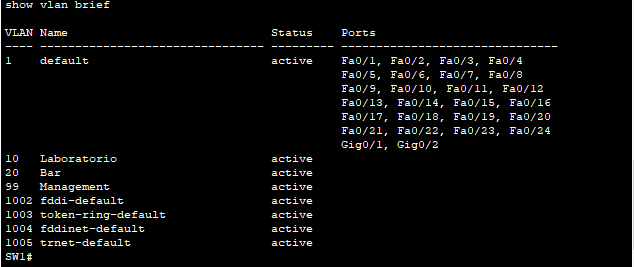
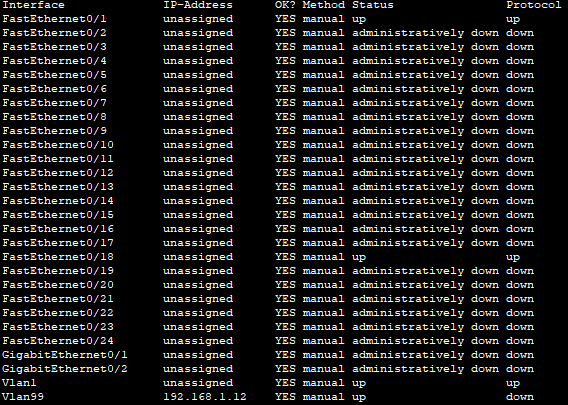
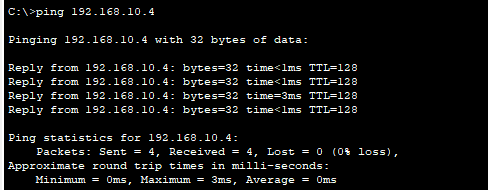
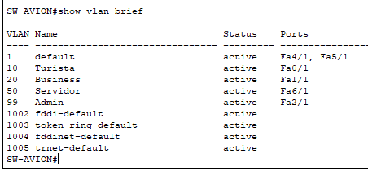
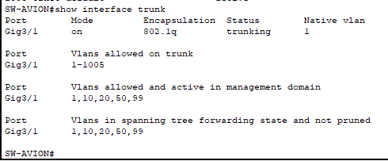
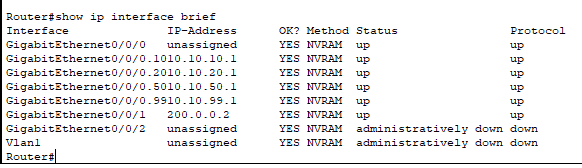

# Trabajo práctico N°4

**Nombres**  
- Callovi, Lautaro
- Galoppo, José M.
- Moreyra, Julián
- Rivera, Luis M.

**Nombre del grupo**: pingFloyd

**Nombre del centro educativo**: FCEFYN - UNC

**Nombre del curso o materia**: Comunicación de datos

**Profesores**
- Solinas, Miguel A.
- Henn, Santiago M.
- Oliva Cuneo, Facundo N.

**Fecha**: 15 de noviembre de 2025

---
### Información de los autores
 
**Información de contacto**:
- jose.maria.galoppo@mi.unc.edu.ar (Galoppo, José María)
- luismarianorivera.25@mi.unc.edu.ar (Rivera, Luis Mariano)
- julian.moreyra@mi.unc.edu.ar (Moreyra, Julián)
- lautaro.callovi@mi.unc.edu.ar (Callovi, Lautaro Nicolás)
---

## Resumen

Este informe detalla el estudio y la aplicación práctica de la segmentación de redes mediante Redes de Área Local Virtuales (VLANs). El trabajo abarca desde los fundamentos teóricos hasta implementaciones prácticas de complejidad creciente. 
Inicialmente, se definen los conceptos teóricos clave, incluyendo la clasificación de redes (LAN, MAN, WAN), el funcionamiento de las VLANs y el protocolo de etiquetado IEEE 802.1Q. 
Posteriormente, se demuestra una configuración de Capa 2 básica, implementando un enlace troncal (trunk) entre dos switches para permitir la comunicación de dispositivos en una misma VLAN. 
Finalmente, el trabajo culmina con el despliegue de una simulación de red avanzada para una aeronave, integrando enrutamiento Inter-VLAN ("Router-on-a-Stick"), servicios DHCP, Listas de Control de Acceso (ACLs) para políticas de seguridad diferenciadas, y Traducción de Direcciones de Red (NAT) para gestionar el acceso controlado a Internet. Los resultados validan la correcta configuración y el cumplimiento de los requisitos en todos los escenarios mediante pruebas de conectividad.

---
## Introducción

El objetivo de este trabajo práctico es aplicar los conceptos fundamentales de la comunicación de datos para diseñar, implementar y verificar redes segmentadas que respondan a distintos requisitos de conectividad y seguridad.

El informe se estructura en tres partes principales que van desde la teoría hasta la práctica avanzada. La Actividad 1 establece el marco conceptual, definiendo la clasificación de redes según su alcance (PAN, LAN, MAN, WAN), el concepto de VLAN como mecanismo de segmentación lógica y el protocolo estándar IEEE 802.1Q, que permite el etiquetado de tramas (tagging) para el transporte de múltiples VLANs sobre enlaces troncales.

La Actividad 2 traslada esta teoría a un escenario práctico de Capa 2. En ella, se configura un enlace troncal entre dos switches físicos distintos, demostrando cómo los dispositivos (PCs) pertenecientes a la misma VLAN (VLAN 10) pueden comunicarse, mientras se mantiene una VLAN de gestión (VLAN 99) separada para la administración de los propios switches.

La Actividad 3 integra todos los conceptos en una simulación compleja de Capa 3, que representa la red de una aeronave. El desafío en este escenario fue diseñar una red que cumpla con requisitos de seguridad y servicio diferenciados.

Para lograr esta segmentación y control, se utilizaron las siguientes tecnologías:
* VLANs (Redes Virtuales): Para separar lógicamente las tres redes de usuarios y la del servidor, aunque estuvieran conectadas al mismo switch físico.
* Enrutamiento Inter-VLAN: Mediante el método "Router-on-a-Stick", para permitir que el router actúe como gateway para todas las VLANs y enrute el tráfico entre ellas.
* ACLs (Listas de Control de Acceso): Para actuar como un "firewall", filtrando el tráfico y aplicando las reglas de negocio (ej. "Turista SÓLO ve al servidor").
* NAT (Traducción de Direcciones de Red): Para permitir que las redes internas (Business y Admin) salgan a Internet usando una única IP pública.

---
# Desarrollo

## Actividad 1

### Clasificación de redes según su alcance

Las redes se clasifican comúnmente según su alcance geográfico de la siguiente manera:

* **PAN (Personal Area Network - Red de Área Personal):**
    * **Características:** Es la red de menor alcance, cubriendo el espacio de trabajo de un solo individuo (generalmente unos pocos metros). Se utiliza para conectar dispositivos personales como teclados, ratones, auriculares y smartphones.
    * **Ejemplo:** Bluetooth, Zigbee.

* **LAN (Local Area Network - Red de Área Local):**
    * **Características:** Cubre un área geográfica limitada como una oficina, un edificio, un hogar o un campus pequeño. Se caracteriza por altas velocidades de transmisión (desde 100 Mbps a 10 Gbps) y baja latencia, ya que la infraestructura es propiedad de la organización.
    * **Ejemplo:** Una red Ethernet cableada en una oficina o una red Wi-Fi (conocida como WLAN) en una casa.

* **MAN (Metropolitan Area Network - Red de Área Metropolitana):**
    * **Características:** Cubre un área más grande que una LAN, como una ciudad entera o un gran campus universitario. Suelen interconectar múltiples LANs.
    * **Ejemplo:** Redes de fibra óptica de proveedores de servicios de cable en una ciudad.

* **WAN (Wide Area Network - Red de Área Amplia):**
    * **Características:** Cubre una gran área geográfica (país, continente o el mundo entero). Interconecta múltiples LANs y MANs que no están geográficamente cercanas. Las velocidades son más variables y las latencias más altas que en las LANs, ya que a menudo dependen de enlaces de proveedores de servicios.
    * **Ejemplo:** Internet es el ejemplo más grande de una WAN.


### ¿Qué es una VLAN?

Una **VLAN (Virtual Local Area Network)** o Red de Área Local Virtual, es un método para crear redes lógicas independientes dentro de una misma infraestructura de red física.

Permite agrupar dispositivos en diferentes segmentos de red como si estuvieran en la misma red física, aunque estén conectados a diferentes switches. Su principal ventaja es que segmenta los dominios de broadcast, lo que mejora el rendimiento y la seguridad de la red. Los dispositivos en una VLAN no pueden comunicarse directamente con dispositivos en otra VLAN sin un dispositivo de Capa 3 (como un router).

### ¿Cómo se clasifican?

Las VLANs se pueden clasificar según el método utilizado para asignar la pertenencia de un dispositivo a una VLAN:

1.  **VLAN Estática (Basada en Puerto):** Es el método más común y el que se usa en este práctico. La pertenencia a la VLAN se configura manualmente asignando puertos específicos de un switch a una VLAN determinada. Cualquier dispositivo que se conecte a ese puerto pertenece automáticamente a esa VLAN. Es segura y fácil de configurar, pero menos flexible si un usuario se mueve mucho.

2.  **VLAN Dinámica (Basada en Dirección MAC):** La pertenencia se asigna dinámicamente según la dirección MAC del dispositivo que se conecta. Requiere un servidor central (llamado VMPS - VLAN Management Policy Server) que mantiene una base de datos de direcciones MAC y su VLAN correspondiente. Es más flexible, pero más compleja de administrar.

3.  **VLAN Basada en Protocolo:** La pertenencia se determina por el protocolo de Capa 3 que transporta el paquete (por ejemplo, IP o IPX). Es menos común en redes modernas.

### Protocolo IEEE 802.1Q

**IEEE 802.1Q** es el estándar de la industria que define el método de etiquetado de tramas (frame tagging) para implementar VLANs sobre redes Ethernet.

**Relación con las VLANs:**
Su función principal es permitir que el tráfico de múltiples VLANs atraviese un único enlace físico (conocido como enlace troncal o trunk) entre switches, sin que se mezclen los dominios de broadcast.

Para lograr esto, el protocolo 802.1Q funciona insertando una etiqueta (tag) de 4 bytes en el encabezado de la trama Ethernet original, justo después de la dirección MAC de origen.


Esta etiqueta contiene:
* **TPID (Tag Protocol Identifier):** 2 bytes. Tiene un valor fijo de `0x8100` que identifica la trama como una trama 802.1Q.
* **TCI (Tag Control Information):** 2 bytes, que se subdividen en:
    * PCP (Priority Code Point): 3 bits para Calidad de Servicio (QoS).
    * DEI (Drop Eligible Indicator): 1 bit para indicar si la trama puede ser descartada bajo congestión.
    * VLAN ID (VLAN Identifier): 12 bits que especifican el número de la VLAN a la que pertenece la trama. Este campo es el corazón del protocolo, ya que permite identificar hasta 4094 VLANs utilizables (de 1 a 4094, ya que 0 y 4095 están reservados).

Cuando una trama de una VLAN debe cruzar un enlace troncal, el switch de origen le añade esta etiqueta. El switch receptor la lee, sabe a qué VLAN pertenece la trama y la reenvía solo a los puertos de esa VLAN.

### Tagging (Etiquetado)

En el contexto de las VLANs y el protocolo 802.1Q, el "Tagging" (etiquetado) es el proceso de añadir la etiqueta 802.1Q de 4 bytes a una trama Ethernet.

Este proceso es fundamental para el funcionamiento de los enlaces troncales (trunk):

1.  Una trama llega a un switch desde un dispositivo final (PC) a través de un puerto de acceso (un puerto asignado a una sola VLAN, ej: VLAN 10). Esta trama original no tiene etiqueta.
2.  El switch determina que la trama debe ser enviada a otro switch a través de un puerto troncal.
3.  Antes de enviarla por el troncal, el switch añade (tagging) la etiqueta 802.1Q a la trama, especificando el VLAN ID (ej: 10).
4.  La trama "etiquetada" viaja por el enlace troncal.
5.  El switch receptor recibe la trama, lee la etiqueta, e identifica que pertenece a la VLAN 10.
6.  Cuando la trama va a salir por un puerto de acceso hacia el dispositivo final de destino (en la VLAN 10), el switch remueve la etiqueta (untagging) y entrega la trama Ethernet original.


## Actividad 2

### Objetivo
Implementar una topología que cuente con **2 switches** y **2 PCs**, asignando direcciones IP, configurando VLANs y verificando la conectividad entre los dispositivos.

###  Topología y direccionamiento

- Se agregaron **dos switches (2960-24TT)** y **dos PCs**.
- Las PCs se conectaron de la siguiente manera:
  - PC-A al **puerto Fa0/6** del **SW1**  
  - PC-B al **puerto Fa0/18** del **SW2**
- Los switches se interconectaron mediante un cable **crossover** entre los puertos **Fa0/1 ↔ Fa0/1**


| Device | Interface | IP Address    | Subnet Mask     | Default Gateway |
|--------|-----------|---------------|------------------|-----------------|
| SW-1   | VLAN 1    | 192.168.1.11  | 255.255.255.0   | N/A             |
| SW-2   | VLAN 1    | 192.168.1.12  | 255.255.255.0   | N/A             |
| PC-A   | NIC       | 192.168.10.3  | 255.255.255.0   | 192.168.10.1    |
| PC-B   | NIC       | 192.168.10.4  | 255.255.255.0   | 192.168.10.1    |

###  Procedimiento paso a paso

**1. Configuración básica de los switches**

En ambos switches se ingresó a la terminal desde la PC por cable consola y se realizaron los siguientes pasos:

```bash
Switch> enable
Switch# configure terminal
Switch(config)# hostname SW1     # o SW2 según corresponda
Switch(config)# enable secret tp4sw1exec
Switch(config)# line console 0
Switch(config-line)# password tp4sw1console
Switch(config-line)# login
Switch(config-line)# exit
Switch(config)# line vty 0 15
Switch(config-line)# password tp4sw1vty
Switch(config-line)# login
Switch(config-line)# exit
Switch(config)# service password-encryption
```

**2. Configuracion de redes VLAN**

Se asignaron las IPs correspondientes: 

*SW1*

```bash
SW1(config)# interface vlan 1
SW1(config-if)# ip address 192.168.1.11 255.255.255.0
SW1(config-if)# no shutdown
```

*SW2*
```bash
SW2(config)# interface vlan 1
SW2(config-if)# ip address 192.168.1.12 255.255.255.0
SW2(config-if)# no shutdown
```


**3. Desconexion de interfaces no utilizadas**

*SW1*

```bash
SW1# show interface brief
SW1# conf t
SW1(config)# interface range fastethernet0/2 - 5 , fastethernet0/7 - 24 , gigabitethernet0/1 - 2
shutdown
end
```

*SW2*
```bash
SW2# show interface brief
SW2# conf t
SW2(config)# interface range fastethernet0/2 - 17 , fastethernet0/17 - 24 , gigabitethernet0/1 - 2
shutdown
end
```

Posteriormente se escribio la configuracion en memoria. El paso de testear con ping en esta instancia no se realizo puesto que las configuraciones estan incompletas, fallando el ping.


**4. Creacion de VLANs**

En ambos switches se crearon las VLANs requeridas para el trabajo practico:

```bash
SW1(config)# vlan 10
SW1(config-vlan)# name Laboratorio
SW1(config-vlan)# vlan 99
SW1(config-vlan)# name Management
SW1(config-vlan)# exit
```

**5. Configuracion del enlace trunk entre switches**

```bash
SW1(config)# interface fa0/1
SW1(config-if)# switchport mode trunk
SW1(config-if)# end
```
```bash
SW2(config)# interface fa0/1
SW2(config-if)# switchport mode trunk
SW2(config-if)# end
```

**6. Asignacion de puertos a VLAN 10 (Laboratorio)**

```bash
SW1(config)# interface fa0/6
SW1(config-if)# switchport mode access
SW1(config-if)# switchport access vlan 10
SW1(config-if)# end
```
```bash
SW2(config)# interface fa0/18
SW2(config-if)# switchport mode access
SW2(config-if)# switchport access vlan 10
SW2(config-if)# end
```

**7. Configuracion de Management**

```bash
SW1(config)# interface vlan 1  
SW1(config-if)# no ip address  
SW1(config-if)# interface vlan 99  
SW1(config-if)# ip address 192.168.1.11 255.255.255.0
SW1(config-if)# end 
```

```bash
SW2(config)# interface vlan 1  
SW2(config-if)# no ip address  
SW2(config-if)# interface vlan 99  
SW2(config-if)# ip address 192.168.1.12 255.255.255.0
SW2(config-if)# end 
```

### Verificacion de estados de VLAN e interfaces





### Verificacion de conectividad mediante ping



!


## Actividad 3
  
### Topologia

La topología implementada consiste en un router principal (Router0) que gestiona todo el tráfico y los servicios. Este se conecta a un switch que crea los segmentos de red. A este switch se conectan los dispositivos finales: Puntos de Acceso para las redes inalámbricas de Turista y Business, un PC para Admin y el Servidor de entretenimiento. Un segundo router (ISP) simula al proveedor de Internet y al destino 8.8.8.8


### Esquema de Direccionamiento IP
| NOMBRE | VLAN | RED IP | GATEWAY |
|-------|--------------|---------------------|---------------------------|
| Turista | 10 | 10.10.10.0/24 | 10.10.10.1 |
| Business | 20 | 10.10.20.0/24 | 10.10.20.1 |
| Servidor | 50 | 10.10.50.0/24 | 10.10.50.1 |
| Admin | 99 | 10.10.99.0/24 | 10.10.99.1 |

### Configuración de Nivel 2: Segmentación (Switch)

Se crearon las VLANs 10, 20, 50 y 99.
Los puertos conectados a los APs, al PC de Admin y al Servidor se configuraron como puertos de acceso, asignando cada uno a su VLAN correspondiente.
El puerto que conecta el Switch con el Router se configuró en modo trunk para permitir el paso de tráfico etiquetado de todas las VLANs






### Configuración de Nivel 3: Enrutamiento y Servicios (Router)

Se crearon subinterfaces virtuales (ej. GigabitEthernet0/0/0.10) para cada VLAN. A cada una se le asignó la encapsulación dot1q correspondiente y la dirección IP de su gateway.
Se configuraron pools de DHCP para las VLANs 10, 20 y 99, permitiendo que los dispositivos de los usuarios obtengan una dirección IP, máscara y gateway automáticamente al conectarse.




### Implementación de Políticas de Seguridad (ACL y NAT)

Se crearon Listas de Control de Acceso para filtrar el tráfico en la entrada de cada subinterfaz:

* ACL-TURISTA: Permite explícitamente el tráfico DHCP y el tráfico hacia el host del Servidor (10.10.50.10). Termina con un deny ip any any para bloquear todo lo demás (Internet, Admin, etc.).

* ACL-BUSINESS: Permite DHCP, permite el tráfico al Servidor, deniega el tráfico a las otras VLANs internas (Turista y Admin) y finalmente permite (permit ip any any) el resto del tráfico, que será el destinado a Internet.

Se configuró NAT Overload para dar salida a Internet.
Se definieron las interfaces ip nat inside (las subinterfaces de las VLANs) y ip nat outside (la interfaz hacia el ISP).
Se creó una ACL-PARA-NAT que especifica quién puede salir: permit 10.10.20.0 (Business) y permit 10.10.99.0 (Admin). La red Turista (10.10.10.0) no está en esta lista entonces no puede ser traducida.


### Pruebas

**Caso 1: Host Turista (VLAN 10)**


**Caso 2: Host Business (VLAN 20)**


**Caso 3: Host Admin (VLAN 99)**


---
## Conclusiones 

Este trabajo práctico permitió validar de forma integral el diseño e implementación de redes segmentadas, llevando los fundamentos teóricos a una simulación compleja.

El trabajo partió de la consolidación de los conceptos de la Actividad 1, donde se comprendió la importancia de las VLANs para aislar dominios de broadcast y el rol del protocolo 802.1Q.

Estos conceptos se aplicaron con éxito en la Actividad 2. Las pruebas de conectividad verificaron que:

* Las PCs pertenecientes a la VLAN 10 se comunicaron correctamente entre sí gracias al enlace troncal (trunk) configurado entre los switches.

* Los switches pudieron administrarse de forma segura a través de su propia VLAN de gestión (VLAN 99). Esto demostró cómo la segmentación de Capa 2 permite aislar el tráfico y organizar la red de forma eficiente.

Finalmente, la Actividad 3 integró todos estos conceptos en una simulación avanzada de Capa 3. Se diseñó e implementó con éxito la infraestructura de red de la aeronave, cumpliendo todos los objetivos. Las pruebas finales demostraron que la combinación de Enrutamiento Inter-VLAN, ACLs y NAT fue la solución correcta para:

* Aislar a la red Turista.

* Dar acceso controlado a Internet a la red Business.

* Mantener el control total para la red Admin.

En conjunto, el proyecto demuestra cómo estas tecnologías (VLANs, Trunks, ACLs y NAT) se combinan para formar una solución robusta y eficaz, permitiendo construir redes seguras que se adaptan a requisitos empresariales complejos.


