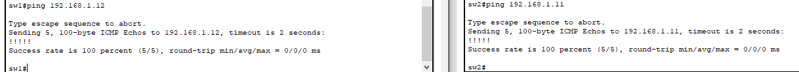

# Consigna 2 – Conexión de VLAN en Packet Tracer

### Objetivo
Implementar una topología que cuente con **2 switches** y **2 PCs**, asignando direcciones IP, configurando VLANs y verificando la conectividad entre los dispositivos.

---

##  Topología y direccionamiento

- Se agregaron **dos switches (2960-24TT)** y **dos PCs**.
- Las PCs se conectaron de la siguiente manera:
  - PC-A al **puerto Fa0/6** del **SW1**  
  - PC-B al **puerto Fa0/18** del **SW2**
- Los switches se interconectaron mediante un cable **crossover** entre los puertos **Fa0/1 ↔ Fa0/1**


| Device | Interface | IP Address    | Subnet Mask     | Default Gateway |
|--------|-----------|---------------|------------------|-----------------|
| SW-1   | VLAN 1    | 192.168.1.11  | 255.255.255.0   | N/A             |
| SW-2   | VLAN 1    | 192.168.1.12  | 255.255.255.0   | N/A             |
| PC-A   | NIC       | 192.168.10.3  | 255.255.255.0   | 192.168.10.1    |
| PC-B   | NIC       | 192.168.10.4  | 255.255.255.0   | 192.168.10.1    |

##  Procedimiento paso a paso

### 1. Configuración básica de los switches

En ambos switches se ingresó a la terminal desde la PC por cable consola y se realizaron los siguientes pasos:

```bash
Switch> enable
Switch# configure terminal
Switch(config)# hostname SW1     # o SW2 según corresponda
Switch(config)# enable secret tp4sw1exec
Switch(config)# line console 0
Switch(config-line)# password tp4sw1console
Switch(config-line)# login
Switch(config-line)# exit
Switch(config)# line vty 0 15
Switch(config-line)# password tp4sw1vty
Switch(config-line)# login
Switch(config-line)# exit
Switch(config)# service password-encryption
```
---

### 2. Configuracion de redes VLAN

Se asignaron las IPs correspondientes: 

**SW1**

```bash
SW1(config)# interface vlan 1
SW1(config-if)# ip address 192.168.1.11 255.255.255.0
SW1(config-if)# no shutdown
```

**SW2**
```bash
SW2(config)# interface vlan 1
SW2(config-if)# ip address 192.168.1.12 255.255.255.0
SW2(config-if)# no shutdown
```
---
### 3. Desconexion de interfaces no utilizadas
**SW1**

```bash
SW1# show interface brief
SW1# conf t
SW1(config)# interface range fastethernet0/2 - 5 , fastethernet0/7 - 24 , gigabitethernet0/1 - 2
shutdown
end
```

**SW2**
```bash
SW2# show interface brief
SW2# conf t
SW2(config)# interface range fastethernet0/2 - 17 , fastethernet0/17 - 24 , gigabitethernet0/1 - 2
shutdown
end
```

Posteriormente se escribio la configuracion en memoria. El paso de testear con ping en esta instancia no se realizo puesto que las configuraciones estan incompletas, fallando el ping.

---
### 4. Creacion de VLANs

En ambos switches se crearon las VLANs requeridas para el trabajo practico:

```bash
SW1(config)# vlan 10
SW1(config-vlan)# name Laboratorio
SW1(config-vlan)# vlan 99
SW1(config-vlan)# name Management
SW1(config-vlan)# exit
```

---

### 5. Configuracion del enlace trunk entre switches
```bash
SW1(config)# interface fa0/1
SW1(config-if)# switchport mode trunk
SW1(config-if)# end
```
```bash
SW2(config)# interface fa0/1
SW2(config-if)# switchport mode trunk
SW2(config-if)# end
```
---
### 6. Asignacion de puertos a VLAN 10 (Laboratorio)
```bash
SW1(config)# interface fa0/6
SW1(config-if)# switchport mode access
SW1(config-if)# switchport access vlan 10
SW1(config-if)# end
```
```bash
SW2(config)# interface fa0/18
SW2(config-if)# switchport mode access
SW2(config-if)# switchport access vlan 10
SW2(config-if)# end
```
--- 
### 7. Configuracion de Management
```bash
SW1(config)# interface vlan 1  
SW1(config-if)# no ip address  
SW1(config-if)# interface vlan 99  
SW1(config-if)# ip address 192.168.1.11 255.255.255.0
SW1(config-if)# end 
```

```bash
SW2(config)# interface vlan 1  
SW2(config-if)# no ip address  
SW2(config-if)# interface vlan 99  
SW2(config-if)# ip address 192.168.1.12 255.255.255.0
SW2(config-if)# end 
```

Verificacion de estados de VLAN e interfaces:


### 8. Verificacion de conectividad mediante ping

!

##Conclusiones 

- Los switches pudieron comunicarse correctamente mediante sus interfaces VLAN 99.

- Las PCs pertenecientes a la VLAN 10 se comunicaron entre sí gracias al enlace trunk configurado entre los switches.

- La segmentación mediante VLANs permite aislar el tráfico y organizar la red de forma eficiente, mientras que los enlaces trunk posibilitan transportar múltiples VLANs a través de un solo enlace físico.