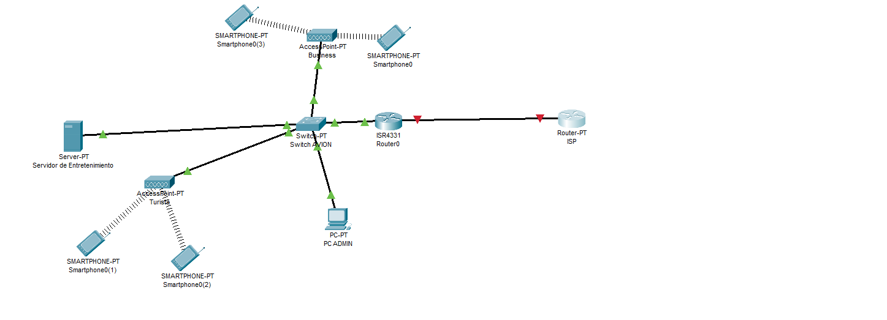
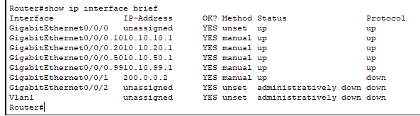
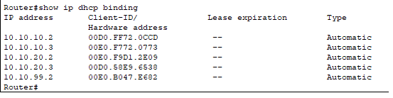
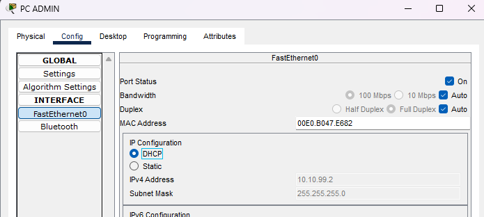
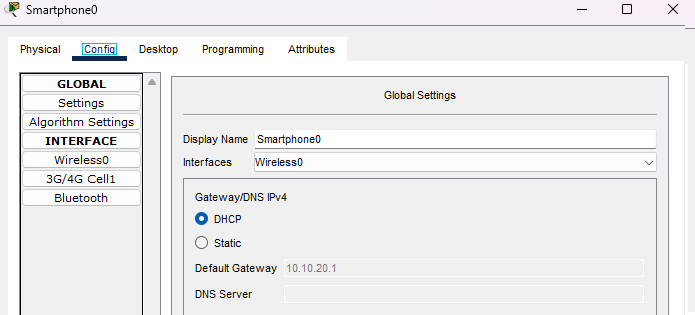
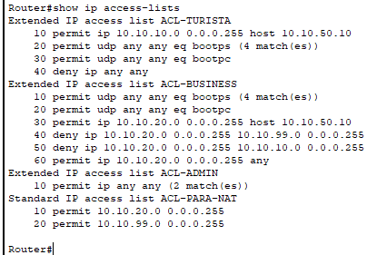
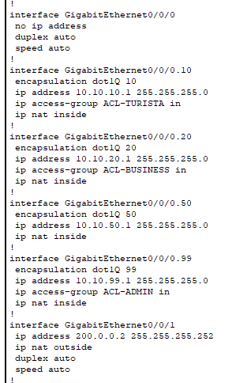
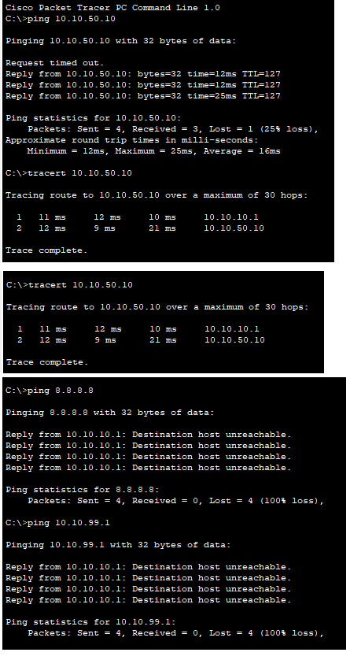
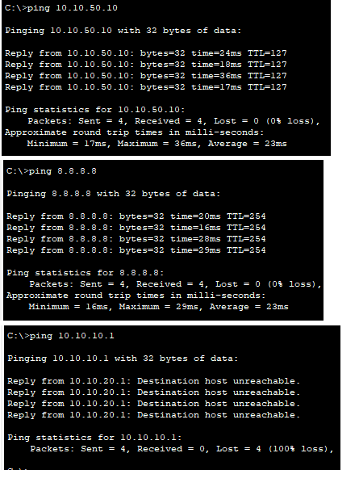
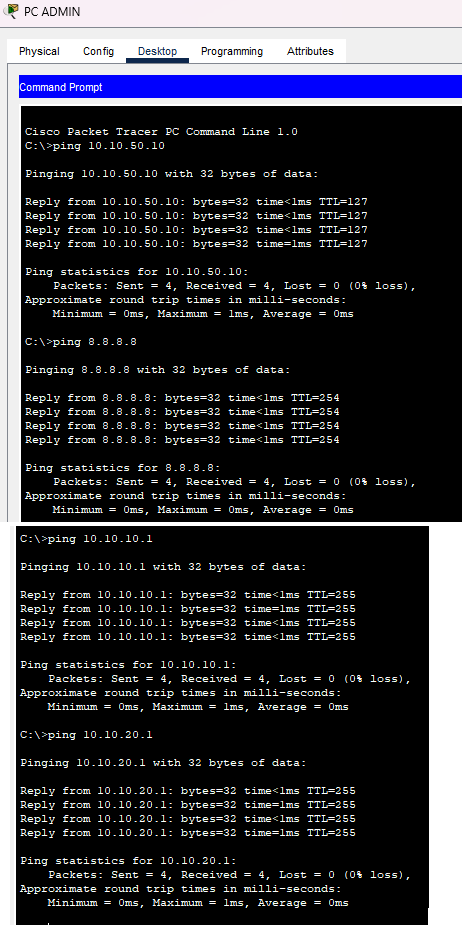

## Resumen punto 3

En el trabajo se incluye el despliegue de una red de práctica donde se aplican reglas ACL y traducciones NAT. El objetivo fue simular la infraestructura de red de una aeronave, segmentando a los usuarios en redes virtuales (VLANs) según su clase (Turista, Business) y rol (Administración). Se implementaron políticas de seguridad para controlar el acceso al servidor de entretenimiento e Internet, validando la configuración mediante pruebas de conectividad.

---
## Introducción punto 3

El trabajo concluye con la creación de una red para un avión donde se aplican conceptos de VLAN, ACL y NAT para simular un servicio de internet en un avión según el cliente turista o business. Además se incluye una red admin.
El desafío principal fue diseñar una red que cumpla con requisitos de seguridad y servicio diferenciados para cada tipo de usuario. La red de Clase Turista debía estar completamente aislada, con acceso exclusivo al servidor de entretenimiento. La red de Clase Business requería acceso tanto al servidor como a Internet. Finalmente, la red de Administración necesitaba acceso total para fines de gestión.
Para lograr esta segmentación y control, se utilizaron las siguientes tecnologías:
* VLANs (Redes Virtuales): Para separar lógicamente las tres redes de usuarios y la del servidor, aunque estuvieran conectadas al mismo switch físico.
* Enrutamiento Inter-VLAN: Mediante el método "Router-on-a-Stick", para permitir que el router actúe como gateway para todas las VLANs y enrute el tráfico entre ellas.
* ACLs (Listas de Control de Acceso): Para actuar como un "firewall", filtrando el tráfico y aplicando las reglas de negocio (ej. "Turista SÓLO ve al servidor").
* NAT (Traducción de Direcciones de Red): Para permitir que las redes internas (Business y Admin) salgan a Internet usando una única IP pública.
  
---
# Desarrollo 
## Actividad 3

### Topologia

La topología implementada consiste en un router principal (Router0) que gestiona todo el tráfico y los servicios. Este se conecta a un switch que crea los segmentos de red. A este switch se conectan los dispositivos finales: Puntos de Acceso para las redes inalámbricas de Turista y Business, un PC para Admin y el Servidor de entretenimiento. Un segundo router (ISP) simula al proveedor de Internet y al destino 8.8.8.8

### Esquema de Direccionamiento IP
| NOMBRE | VLAN | RED IP | GATEWAY |
|-------|--------------|---------------------|---------------------------|
| Turista | 10 | 10.10.10.0/24 | 10.10.10.1 |
| Business | 20 | 10.10.20.0/24 | 10.10.20.1 |
| Servidor | 50 | 10.10.50.0/24 | 10.10.50.1 |
| Admin | 99 | 10.10.99.0/24 | 10.10.99.1 |

### Configuración de Nivel 2: Segmentación (Switch)

Se crearon las VLANs 10, 20, 50 y 99.
Los puertos conectados a los APs, al PC de Admin y al Servidor se configuraron como puertos de acceso, asignando cada uno a su VLAN correspondiente.
El puerto que conecta el Switch con el Router se configuró en modo trunk para permitir el paso de tráfico etiquetado de todas las VLANs

### Configuración de Nivel 3: Enrutamiento y Servicios (Router)

Se crearon subinterfaces virtuales (ej. GigabitEthernet0/0/0.10) para cada VLAN. A cada una se le asignó la encapsulación dot1q correspondiente y la dirección IP de su gateway.
Se configuraron pools de DHCP para las VLANs 10, 20 y 99, permitiendo que los dispositivos de los usuarios obtengan una dirección IP, máscara y gateway automáticamente al conectarse.

### Implementación de Políticas de Seguridad (ACL y NAT)

Se crearon Listas de Control de Acceso para filtrar el tráfico en la entrada de cada subinterfaz:

* ACL-TURISTA: Permite explícitamente el tráfico DHCP y el tráfico hacia el host del Servidor (10.10.50.10). Termina con un deny ip any any para bloquear todo lo demás (Internet, Admin, etc.).

* ACL-BUSINESS: Permite DHCP, permite el tráfico al Servidor, deniega el tráfico a las otras VLANs internas (Turista y Admin) y finalmente permite (permit ip any any) el resto del tráfico, que será el destinado a Internet.

Se configuró NAT Overload para dar salida a Internet.
Se definieron las interfaces ip nat inside (las subinterfaces de las VLANs) y ip nat outside (la interfaz hacia el ISP).
Se creó una ACL-PARA-NAT que especifica quién puede salir: permit 10.10.20.0 (Business) y permit 10.10.99.0 (Admin). La red Turista (10.10.10.0) no está en esta lista entonces no puede ser traducida.

### Pruebas

**Caso 1: Host Turista (VLAN 10)**

**Caso 2: Host Business (VLAN 20)**

**Caso 3: Host Admin (VLAN 99)**

---
## Conclusiones punto 3

Se ha diseñado e implementado con éxito una infraestructura de red segura y segmentada que simula el entorno de una aeronave, cumpliendo con todos los objetivos y requisitos planteados.
La combinación de VLANs para el aislamiento, Enrutamiento Inter-VLAN para la comunicación controlada, ACLs para la aplicación de políticas de seguridad específicas, y NAT para la gestión del acceso a Internet, demostró ser una buena solución.
