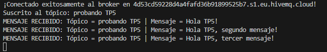
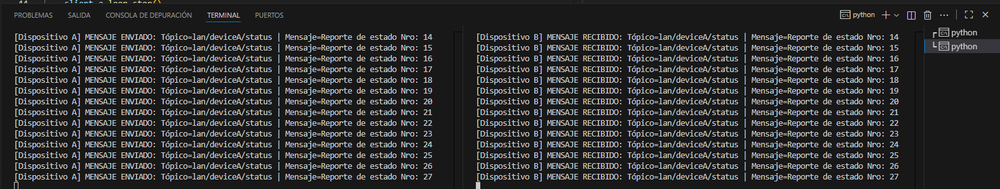

# Trabajo Práctico N°5

**Integrantes**  
- Callovi, Lautaro
- Galoppo, José María
- Moreyra, Julián
- Rivera, Luis Mariano

**Grupo**: pingFloyd

**Centro educativo**: FCEFYN - UNC

**Asignatura**: Comunicaciones de Datos

**Profesores**
- Solinas, Miguel A.
- Henn, Santiago M.
- Oliva Cuneo, Facundo N.

**Fecha**: 15 de noviembre de 2025

---
### Información de los autores
 
**Información de contacto**:
- jose.maria.galoppo@mi.unc.edu.ar (Galoppo, José María)
- luismarianorivera.25@mi.unc.edu.ar (Rivera, Luis Mariano)
- julian.moreyra@mi.unc.edu.ar (Moreyra, Julián)
- lautaro.callovi@mi.unc.edu.ar (Callovi, Lautaro Nicolás)
---

## Resumen

## Introducción

# Desarrollo

## Actividad 1
MQTT es un protocolo de mensajería basado en el patrón de diseño Pub/Sub (Publisher/Subscriber), es un protocolo estandar para IoT (Internet of Things). Es óptimo para para dispositivos con poca potencia y redes de mala calidad.

+ Ligero: el encabezado de un mensaje MQTT puede ser tan pequeño como 2 bytes, minimizando el consumo de ancho de banda y batería.
+ Asíncrono: El publisher no se queda pendiente a alguna respuesta, el solo publica.
+ Sesiones persistentes: el broker puede recordar a un cliente, sus suscripciones y hasta los mensajes que no le pudo entregar mientras estaba desconectado.

|                       VENTAJAS                        |         DESVENTAJAS           |
|-------------------------------------------------------|-------------------------------|
|Bajo consumo de red y batería                          |No está hecho para grandes datos|  
|Funciona muy bien en redes inestables                  |La seguridad debe implementarse|
|Altamente escalable                                    |Dependencia del Broker         | 
|Desacoplamiento total entre dispositivos               |No es punto a punto            |

Se lo usa principalmente para IoT:

+ Domótica (Casas Inteligentes)
+ Industria 4.0
+ Telemática
+ Monitoreo Médico
+ Aplicaciones Móviles

El patrón de diseño Pub/Sub esta compuesto por:

+ Publishers : Son los que escriben los mensajes. No les importa quién va a leer el artículo, solo lo escriben sobre un tema 
+ Broker : Es el componente central. Recibe todos los artículos mensajes y los clasifica por tópico. No lee los mensajes, solo los organiza.
+ Subscribers : Son los lectores. No conocen a los publishers. Van al broker y se suscriben al tópico de interés.

Entonces cuando un publisher envía un mensaje de algún tópico al broker, el broker mira quienes estan suscriptos a ese tópico y les reenvía una copia de ese mensaje. De esta manera se genera un desacoplamiento grande, el publisher no conoce a los subscribers y los subscribers no saben quienes son los publishers, solo conocen el broker y el tópico.
## Actividad 3
Verificación del broker:

Se muestra el publisher con los mensajes enviados

Se muestra el suscriber recibiendo los mensajes enviados
## Actividad 4
a)
A continuación se muestra la simulación de la comunicación directa entre dos nodos de una red local. El dispositivo A, publica en lan/deviceA/status, dispositivo B se suscribe a ese tópico y
muestra los mensajes recibidos.

b)
Ahora se crea un tópico general lan/broadcast/#. Se configuran dos clientes para suscribirse a
lan/broadcast/#. Desde un cliente “central”, se publicarán mensajes en lan/broadcast/all.

## Conclusiones 

