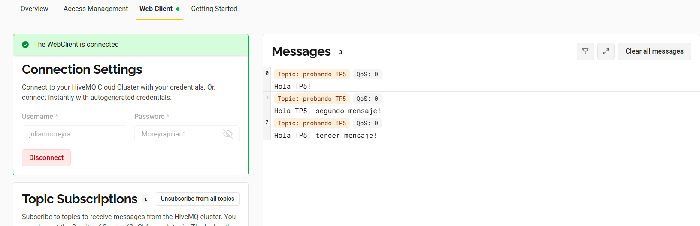
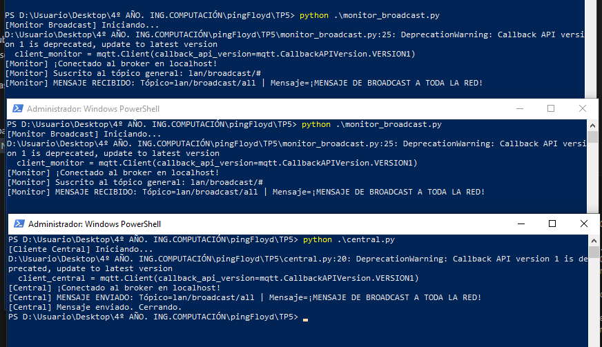
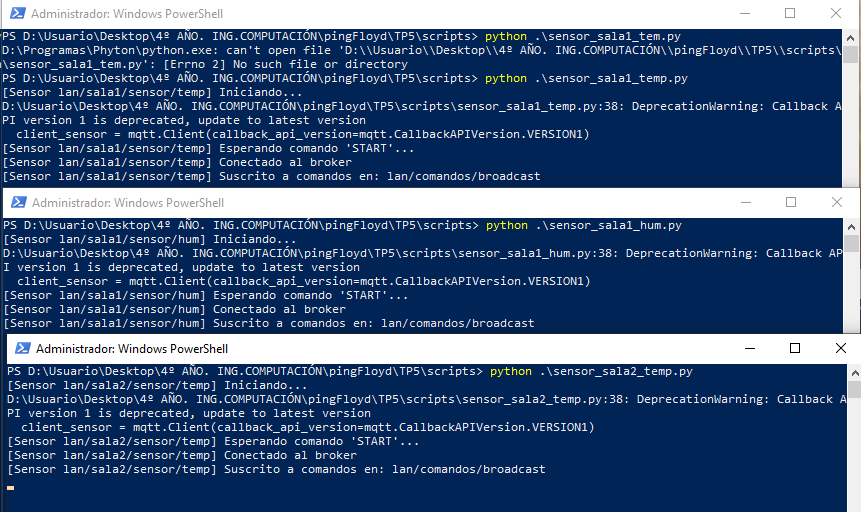
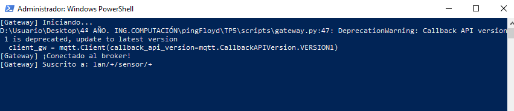
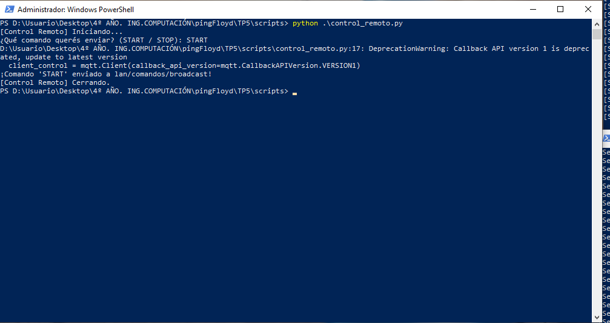
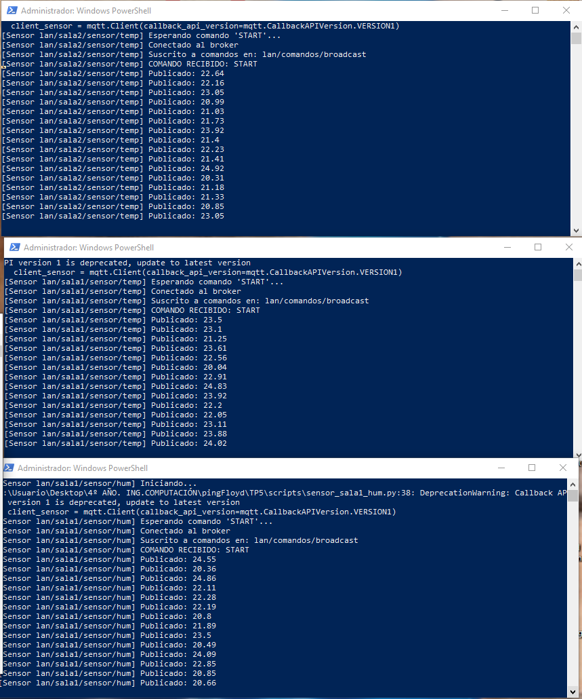
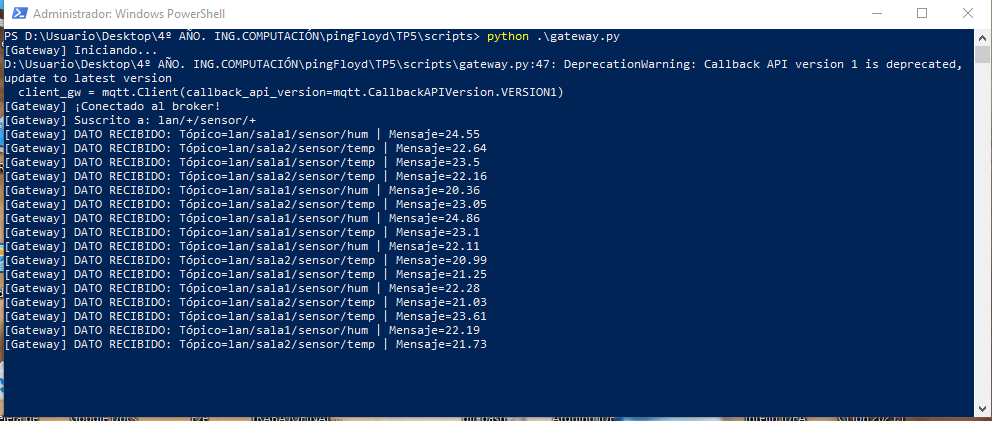
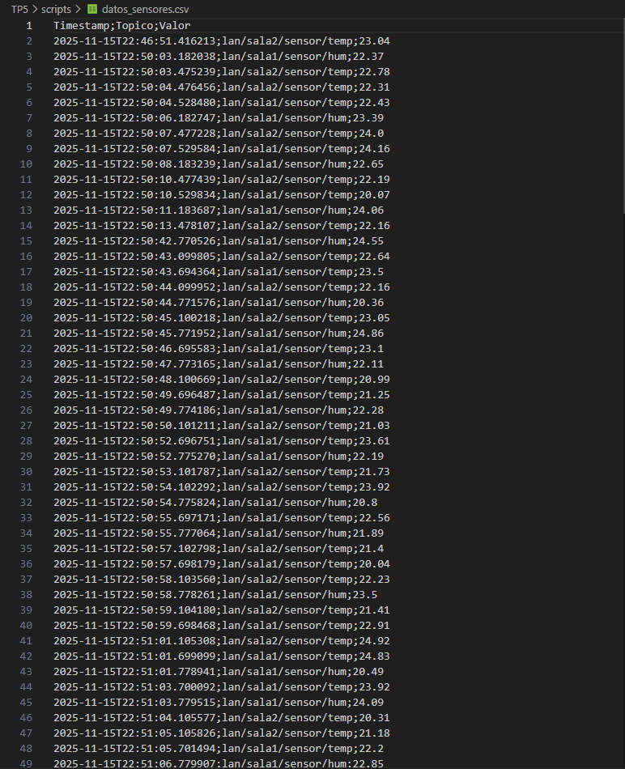
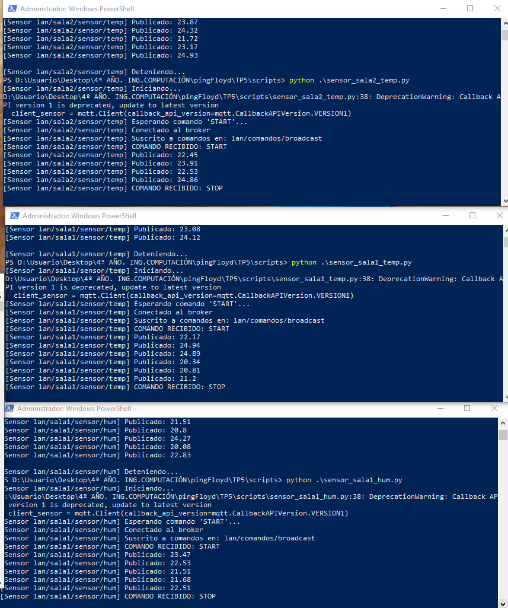
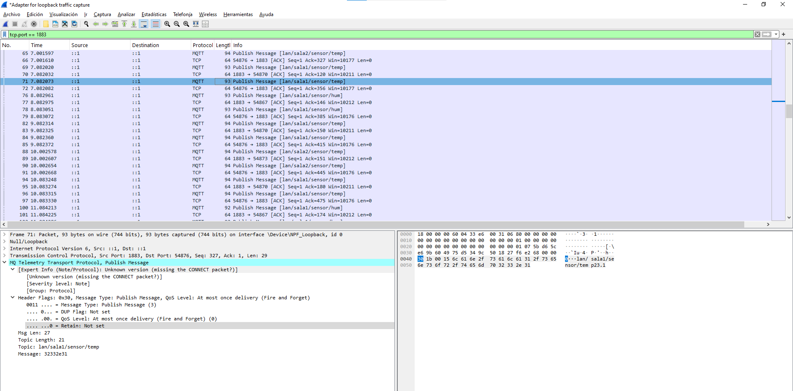

# Trabajo Práctico N°5

**Integrantes**  
- Callovi, Lautaro
- Galoppo, José María
- Moreyra, Julián
- Rivera, Luis Mariano

**Grupo**: pingFloyd

**Centro educativo**: FCEFYN - UNC

**Asignatura**: Comunicaciones de Datos

**Profesores**
- Solinas, Miguel A.
- Henn, Santiago M.
- Oliva Cuneo, Facundo N.

**Fecha**: 15 de noviembre de 2025

---
### Información de los autores
 
**Información de contacto**:
- jose.maria.galoppo@mi.unc.edu.ar (Galoppo, José María)
- luismarianorivera.25@mi.unc.edu.ar (Rivera, Luis Mariano)
- julian.moreyra@mi.unc.edu.ar (Moreyra, Julián)
- lautaro.callovi@mi.unc.edu.ar (Callovi, Lautaro Nicolás)
---

## Resumen
Este trabajo práctico aborda el diseño y la simulación de una red local de tipo IoT utilizando el protocolo MQTT explorando los fundamentos del patrón de diseño Publish/Subscribe (Pub/Sub). El proyecto demostró experimentalmente la comunicación entre dispositivos desacoplados, incluyendo la configuración de tópicos para mensajería directa (lan/deviceA/status) y el uso de comodines (lan/broadcast/#) para simular broadcasting.

La simulación principal integró tres sensores, un gateway y un control remoto. Los sensores publicaron datos en sus respectivos tópicos. El gateway se suscribió a todos los sensores (lan/#) para recopilar y almacenar los datos en un archivo CSV. Se implementó un sistema de control por broadcast (lan/comandos/broadcast) para enviar comandos "START" y "STOP" a todos los sensores. Finalmente, se validó la comunicación analizando los paquetes MQTT con Wireshark y se realizó un análisis teórico de la arquitectura, cubriendo aspectos de seguridad, fiabilidad y las implicaciones de depender de un broker centralizado.
## Introducción
El modelo cliente-servidor tradicional presenta limitaciones en entornos donde los dispositivos pueden estar intermitentes o donde la comunicación "muchos a muchos" es necesaria.

En este contexto, MQTT (Message Queuing Telemetry Transport) se ha consolidado como el estándar para la mensajería en IoT. Su arquitectura se basa en el patrón Publish/Subscribe (Pub/Sub), el cual introduce un intermediario que desacopla por completo a los clientes que publican información de aquellos que la consumen.

El objetivo principal de este trabajo práctico es diseñar, implementar y analizar una red local simulada utilizando MQTT. Se busca comprender en profundidad el flujo de comunicación, desde la configuración de un broker central hasta el desarrollo de múltiples clientes que interactúan en roles de sensores, gateways y sistemas de control.
# Desarrollo

## Actividad 1
MQTT es un protocolo de mensajería basado en el patrón de diseño Pub/Sub (Publisher/Subscriber), es un protocolo estandar para IoT (Internet of Things). Es óptimo para para dispositivos con poca potencia y redes de mala calidad.

+ Ligero: el encabezado de un mensaje MQTT puede ser tan pequeño como 2 bytes, minimizando el consumo de ancho de banda y batería.
+ Asíncrono: El publisher no se queda pendiente a alguna respuesta, el solo publica.
+ Sesiones persistentes: el broker puede recordar a un cliente, sus suscripciones y hasta los mensajes que no le pudo entregar mientras estaba desconectado.

|                       VENTAJAS                        |         DESVENTAJAS           |
|-------------------------------------------------------|-------------------------------|
|Bajo consumo de red y batería                          |No está hecho para grandes datos|  
|Funciona muy bien en redes inestables                  |La seguridad debe implementarse|
|Altamente escalable                                    |Dependencia del Broker         | 
|Desacoplamiento total entre dispositivos               |No es punto a punto            |

Se lo usa principalmente para IoT:

+ Domótica (Casas Inteligentes)
+ Industria 4.0
+ Telemática
+ Monitoreo Médico
+ Aplicaciones Móviles

El patrón de diseño Pub/Sub esta compuesto por:

+ Publishers : Son los que escriben los mensajes. No les importa quién va a leer el artículo, solo lo escriben sobre un tema 
+ Broker : Es el componente central. Recibe todos los artículos mensajes y los clasifica por tópico. No lee los mensajes, solo los organiza.
+ Subscribers : Son los lectores. No conocen a los publishers. Van al broker y se suscriben al tópico de interés.

Entonces cuando un publisher envía un mensaje de algún tópico al broker, el broker mira quienes estan suscriptos a ese tópico y les reenvía una copia de ese mensaje. De esta manera se genera un desacoplamiento grande, el publisher no conoce a los subscribers y los subscribers no saben quienes son los publishers, solo conocen el broker y el tópico.
## Actividad 3
Verificación del broker:

Se muestra el publisher con los mensajes enviados

Se muestra el suscriber recibiendo los mensajes enviados
## Actividad 4
a)
A continuación se muestra la simulación de la comunicación directa entre dos nodos de una red local. El dispositivo A, publica en lan/deviceA/status, dispositivo B se suscribe a ese tópico y
muestra los mensajes recibidos.

b)
Ahora se crea un tópico general lan/broadcast/#. Se configuran dos clientes para suscribirse a
lan/broadcast/#. Desde un cliente “central”, se publicarán mensajes en lan/broadcast/all. A continuación se muestran dos terminales que funcionan como clientes y una central que publica el mismo mensaje a ambas llegando en el mismo momento:

## Actividad 5
Ahora haremos uso de tres sensores o clientes que simularan leer datos y publicarlos, estos son:
+ sensor_sala1_temp
+ sensor_sala1_hum
+ sensor_sala2_temp

A continuación observamos los tres sensores en estado apagado aguardando por la señal para que comenzar a transmitir datos:

Utilizaremos un gateway o servidor que se suscribe a todos los sensores y guarda sus datos en un archivo CSV

Además, haremos uso de un control remoto o broadcasting que envía los comandos START o STOP para que los sensores (que estarán suscritos) empiezan o paren de simular. 

Una vez que enviamos el comando START los sensores comenzarán a enviar datos y el gateway a guardarlos:

A su vez se irá llenando el archivo CSV:

Una vez que enviemos el comando de STOP el gateway dejará de guardar datos y los sensores de enviar información:

A continuación se hará la captura de unos de los paquetes enviados mediante un sniffer:

## Actividad 6
a)
En esta actividad estamos trabajando principalmente sobre TCP (Protocolo de Control de Transmisión). MQTT es un protocolo de capa de aplicación (Capa 7), lo que significa que necesita un protocolo de capa de transporte (Capa 4) confiable para funcionar. Además, MQTT se ejecuta sobre TCP para asegurar que los mensajes lleguen ordenados y sin errores al broker.

b)
+ Integridad: Baja por defecto. TCP (la capa de transporte) tiene checksums para proteger contra corrupción accidental de datos, pero nada impide que un atacante en la red intercepte y modifique un paquete.
+ Confidencialidad: Se utiliza TLS en HiveMQ, que cifra todo el trafico entre cliente y broker.
+ Disponibilidad: Es el punto más débil. La disponibilidad de toda la red depende 100% del broker central. Si el broker (Mosquitto o HiveMQ) se cae, se apaga o crashea, toda la comunicación se detiene. 

c)
Estos juegan el rol de la fiabilidad."QoS" se refiere a la garantía de entrega del mensaje.

+ QoS 0 (At most once): El cliente envía el mensaje y no espera confirmación. Es el más rápido, pero un mensaje podría perderse si la red falla. Fiabilidad nula.

+ QoS 1 (At least once): El cliente envía el mensaje y lo reintenta hasta que recibe una confirmación (PUBACK) del broker. Garantiza que el mensaje llega, pero podría llegar duplicado si la confirmación se pierde. Fiabilidad media.

+ QoS 2 (Exactly once): Usa un handshake de 4 pasos para garantizar que el mensaje no solo llega, sino que se procesa una sola vez. Es el más fiable, pero también el más lento y el que más ancho de banda consume. Fiabilidad total.

d)
La ventaja principal y mas notoria es el total desacoplamiento que existe con un patrón de diseño de tipo Pub/Sub a comparación al de Cliente/Servidor: 

+ Desacoplamiento de espacio: El publicador (sensor) no necesita saber la dirección IP o la existencia del suscriptor (gateway), y viceversa. 

+ Desacoplamiento de Tiempo: El publicador puede enviar un mensaje aunque el suscriptor esté desconectado. El broker puede almacenar los mensajes y entregarlos cuando el suscriptor vuelva a estar online.

+ Escalabilidad: Permite agregar nuevos dispositivos sin afectar la estructura.

e)
MQTT no está hecho para grandes volúmenes de datos, fue diseñado para mensajes muy ligeros (pocos bytes o kilobytes). En una LAN se podrían tener protocolos donde los dispositivos se anuncian y "descubren" automáticamente. En MQTT, cada dispositivo debe tener la dirección IP del broker configurada de antemano ("hardcodeada"), entonces MQTT no termina teniendo el mismo comportamiento o funcionalidad de una LAN ya que todo tipo de comunicación depende de un broker central.

f)
La implicación más grave recae en que si el broker se cae, toda la red se paraliza. Ningún sensor o dispositivo podría reportar y ningún actuador puede ser controlado. Nuevamente todo el tráfico de la red pasa por el broker. Si existen miles de sensores publicando datos cada segundo, el broker puede verse saturado y volverse lento. Además la comunicación nunca es directa, el tener que depender de un broker termina agregando milisegundos de latecia comparado a una conexión directa.

